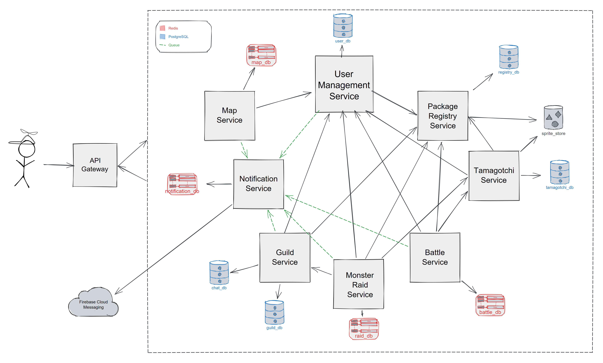

# Tamagotchi Go

Virtual pets and beating up your friends. A distributed system.

Players raise Tamagotchis in apps of their own creation, all connected to a common backend where these worlds meet: encounter nearby players, battle their creatures, join guilds and take down raid monsters together, while keeping your own pet from starving to death.

Developed for the PAD (Distributed Applications Programming) course at FAF, Technical University of Moldova.

## Service Boundaries

### User Management Service

Microservice responsible for the global identity of every user and their account data (username, password, email, and the package(s) they are registered with). Handles authentication and security, and maintains each user's social graph of friends and enemies.

Each user holds two currencies: a **local currency**, whose value and means of acquisition are determined by the individual package the user belongs to, and a **global currency**, shared across the entire ecosystem and primarily earned through battles and other global activities.

This service is the authority for questions such as *"Who is this user?"*, *"Are these two users friends?"*, and *"Does this user have enough global currency?"*. Other services consult it to authenticate players and to resolve relationships and balances before performing currency-affecting operations.

### Tamagotchi Service

Maintains the globally relevant state of all Tamagotchis. A user has a **primary Tamagotchi**, initially provided by the package they downloaded, and may acquire **secondary Tamagotchis** originating from other users or packages. Crucially, secondary Tamagotchis are not new entries but **references to existing ones**.

For each Tamagotchi it stores identity, owner, combat type, level, sprite references, and package-local health statistics (e.g. hunger, tiredness, happiness). These statistics are deliberately **not normalized**, as their management is package-specific.

The service defines six predefined combat types with a cyclic type-advantage system:

```
Flame → Nature → Earth → Electric → Water → Shadow → Flame
```

It provides combat type, level, and health information to the **Battle Service** and **Monster Raid Service** when computing damage, and owner/reference resolution to the **User Management Service**.

### Battle Service

Executes the actual turn-based PvP combat after a match has been created. Each player selects one **primary** and one **secondary** Tamagotchi and may equip available battle boosts.

Combat calculates:

- starting health based on Tamagotchi levels,
- damage based on primary/secondary level, type advantage/disadvantage, equipped boosts, and current Tamagotchi health stats,
- the current battle state and turn.

At the end of the battle, the **winner** receives global currency, XP, and the loser's primary Tamagotchi. The **loser** loses some global currency and receives a smaller amount of XP. XP is distributed between the primary and secondary Tamagotchis following a defined rule (e.g. 60/40).

This service consults the **Tamagotchi Service** for combat stats, XP grants, and ownership transfer; the **User Management Service** for global-currency credit and debit operations; and the **Package Registry Service** for package-specific combat bonuses.

### Map Service

Receives continuous geolocation updates from the user's application. It stores the user's latest known coordinates and timestamp, discarding or ignoring stale locations.

It provides a map of nearby users: friends and enemies are always visible, while unknown users become relevant only when they come within roughly **6 meters** of one another. When two previously unrelated users cross the proximity threshold, the service generates an event that can result in suggestions to befriend or battle one another.

The service **does not** directly manage battles or notifications — it only emits proximity events. It relies on the **User Management Service** for friend/enemy relationships and publishes events consumed by the **Notification Service**.

### Guild Service

Allows users to create and participate in guilds, maintaining guild identity, membership, roles, and permissions. A guild may have an owner/leader, officers, and ordinary members.

It provides **Guild Chat**, letting members communicate in real time. Messages are associated with a guild and carry timestamps and authors; the service may use **WebSockets** directly for the guild-chat connection.

Guilds act as the social context for **Monster Raids**: members can join an active raid and their primary Tamagotchis become participants in the shared battle. Membership and invitation rules use **User Management Service** for user identity and relationships and **Package Registry Service** for package-registration restrictions.

### Monster Raid Service

Provides a cooperative, clicker-style raid in which members of a guild collectively fight a single powerful monster. A raid has a monster with a large amount of health and a defined duration.

Any eligible guild member may contribute their **primary Tamagotchi** to the raid. Instead of a one-on-one battle, every participating Tamagotchi contributes damage to the same monster. The service maintains the current monster HP, participating users, damage dealt, timestamps, and raid status. Actions may be deliberately simple — players repeatedly attack/click to deal damage, with the amount determined by their primary Tamagotchi's combat properties and any equipped boosts.

When the monster dies, the service distributes rewards (global currency, XP, or other globally managed rewards) to participating users. A raid may also **fail** when its timer expires.

It consults the **Guild Service** for eligible members, the **Tamagotchi Service** for combat properties, and the **User Management Service** to distribute rewards.

### Package Registry Service

Maintains the packages of the apps participating in the ecosystem and acts as the configuration service for package-specific and global game content.

It stores package information (identifier/name, version, description, status, associated developers/moderators) and records which users are registered with which packages.

**Moderators** are privileged users associated with a package, representing its developers. They define the package's local Tamagotchi growth mechanics and statistics. Different packages may use completely different, non-normalized statistics — for example, one package may use *hunger, happiness, tiredness*, while another uses *energy, mood, discipline, creativity*. The service stores the definition and interpretation rules for these statistics, including a statistic's maximum value and thresholds that may produce a combat bonus. The **Battle Service** may consult these definitions to compute package-specific bonuses without requiring all packages to share the same data structure.

**Admins** are globally privileged users who design and schedule Monster Raids. They define monster name, description, sprites, maximum HP, combat statistics, weaknesses, resistances, special properties, raid duration, participant limits, and reward configuration, and may schedule, activate, deactivate, or cancel raids.

### Notification Service

Provides asynchronous communication to users through **Firebase push notifications**. Other services publish events, and this service decides how those events are delivered to the client.

Examples include:

- friend request received,
- nearby player detected,
- battle request received,
- another player used or captured a Tamagotchi,
- guild invitation,
- raid started.

It consumes events published by other services (notably the **User Management Service**, **Map Service**, **Battle Service**, **Guild Service**, and **Monster Raid Service**) and delivers them to the appropriate clients.

## Architecture Diagram

Requests flow from the client through the API Gateway, which fronts the microservices. Each service owns its own database. Synchronous calls (solid arrows) handle request/response between services, while asynchronous events (dotted arrows) are published to the Notification Service, which delivers push notifications via Firebase Cloud Messaging. Blobs, images and large JSON documents live in shared S3-compatible object storage; service databases keep only their object keys or URLs.



## Communication Patterns

The architecture uses different communication patterns according to whether a caller needs an immediate result, whether services should remain decoupled, and whether clients require live updates. Solid arrows in the architecture diagram represent synchronous communication, while dashed green arrows represent asynchronous events.

### Client-to-Service Communication

Clients send HTTPS requests through the API Gateway. The gateway routes each request to the service that owns the requested functionality. Public APIs use versioned REST endpoints and JSON payloads because REST is supported consistently by both C# and Go and is easy to inspect and test. The trade-off is additional HTTP and JSON overhead compared with a binary protocol.

### Synchronous Service-to-Service Communication

Services use REST over HTTPS with JSON when the caller needs an immediate response before it can continue. Examples include validating a user, checking guild membership, retrieving Tamagotchi combat statistics, and loading package-specific rules.

Synchronous calls keep request and response flows simple, but they also make the caller depend on the availability of the receiving service. Calls therefore use bounded timeouts. Only idempotent requests may be retried automatically, using exponential backoff.

### Asynchronous Event Communication

Services publish JSON domain events through a message queue when the producer does not require an immediate response. This is used for events such as a nearby player being detected, a guild invitation being created, a battle finishing, or a raid starting. Notification Service consumes relevant events and decides whether a Firebase push notification should be sent.

The queue decouples producers from consumers and allows events to be processed even when a consumer is temporarily unavailable. Because an event may be delivered more than once, every event has a unique `eventId` and consumers handle duplicate delivery idempotently. The concrete queue technology will be selected during implementation.

### Real-Time Client Communication

WebSockets provide bidirectional, low-latency communication for Guild Chat. REST remains responsible for creating or retrieving guild resources; WebSockets are used only for live chat messages. Persistent connections require reconnection handling and make horizontal scaling more complex, so they are limited to the feature that needs live bidirectional updates.

### Push Notifications

Only Notification Service communicates directly with Firebase Cloud Messaging. Other services publish domain events instead of calling Firebase themselves. This keeps provider-specific delivery logic outside the business services, at the cost of depending on an external provider whose delivery is not guaranteed to be immediate.

### Data Ownership

Each microservice owns its database and exposes its data only through its API or published events. A service must never read from or write to another service's database directly. Cross-service operations store identifiers rather than duplicating the authoritative entity.

### Service Interaction Matrix

The following interactions correspond to the arrows in the architecture diagram and the real-time Guild Chat requirement.

| Caller / Producer | Receiver / Consumer | Pattern | Purpose |
|---|---|---|---|
| Client | API Gateway | Synchronous HTTPS | Enter the system and route API requests to the responsible service |
| Client | Guild Service | WebSocket | Send and receive Guild Chat messages in real time |
| Map Service | User Management Service | Synchronous REST | Resolve user identity and friend/enemy relationships for proximity results |
| Map Service | Notification Service | Asynchronous queue event | Report that nearby players were detected |
| User Management Service | Package Registry Service | Synchronous REST | Validate package information associated with a user |
| User Management Service | Notification Service | Asynchronous queue event | Report newly created friend requests |
| Guild Service | User Management Service | Synchronous REST | Validate users, relationships, and permissions used by guild operations |
| Guild Service | Package Registry Service | Synchronous REST | Validate package-related membership information when required |
| Guild Service | Notification Service | Asynchronous queue event | Report newly created guild invitations |
| Monster Raid Service | Guild Service | Synchronous REST | Validate guild membership and raid eligibility |
| Monster Raid Service | User Management Service | Synchronous REST | Credit participating users with global rewards |
| Monster Raid Service | Tamagotchi Service | Synchronous REST | Obtain participating Tamagotchi combat properties |
| Monster Raid Service | Package Registry Service | Synchronous REST | Obtain raid and package-specific combat configuration |
| Monster Raid Service | Notification Service | Asynchronous queue event | Report that a raid started, completed, or failed |
| Battle Service | User Management Service | Synchronous REST | Validate players and apply global currency rewards or losses |
| Battle Service | Tamagotchi Service | Synchronous REST | Obtain combat properties, grant XP, and transfer Tamagotchi ownership |
| Battle Service | Package Registry Service | Synchronous REST | Obtain package-specific combat bonus rules |
| Battle Service | Notification Service | Asynchronous queue event | Report battle invitations and results |
| Tamagotchi Service | Package Registry Service | Synchronous REST | Obtain definitions and interpretation rules for package-local statistics |
| Notification Service | Firebase Cloud Messaging | Provider API | Deliver push notifications to user devices |

### Common Communication Rules

- REST endpoints are versioned under `/api/v1` and use `application/json`.
- Resource paths use plural, lowercase, kebab-case nouns. The same resource collection keeps the same path across HTTP methods; the method expresses the operation.
- State-changing decisions use noun subresources such as `/responses` or a `PATCH` to the resource instead of verb segments such as `/accept` or `/cancel`.
- Event names include a version suffix, for example `guild.invitation.created.v1`.
- Resource and event identifiers use UUID strings.
- Timestamps use UTC ISO 8601 strings.
- External requests use bearer JWT authentication.
- `X-Correlation-ID` traces one operation across services and events.
- Commands that can be submitted more than once accept an `Idempotency-Key`.
- Services return consistent JSON error objects containing `code`, `message`, and `correlationId`.

## Communication Contract

The communication contract defines the data that callers and services exchange. Endpoint and event payloads use JSON. Payload schemas below are also represented as JSON: each property value states its type, requirement and meaning. These schema strings document the wire contract and are not literal runtime values. Fields marked as optional may be omitted; all other fields are required. Unknown fields should be ignored by consumers so that compatible fields can be added later.

### REST Contract Conventions

| Item | Contract |
|---|---|
| Base path | `/api/v1` |
| Content type | `application/json` |
| Authentication | `Authorization: Bearer <JWT>` for external requests |
| Correlation | `X-Correlation-ID: <uuid>`; generated by the gateway when absent |
| Idempotency | `Idempotency-Key: <uuid>` on retriable commands that create side effects |
| Identifier type | UUID encoded as a JSON string |
| Timestamp type | UTC ISO 8601 string, for example `2026-09-07T14:30:00Z` |
| Currency type | Integer amount in the currency's smallest unit |

Successful operations use the following HTTP statuses:

| Status | Meaning |
|---:|---|
| `200 OK` | Resource returned or command completed |
| `201 Created` | New resource created |
| `202 Accepted` | Command accepted for asynchronous processing |
| `204 No Content` | Command completed without a response body |

Errors use an appropriate `4xx` or `5xx` status and the following common body:

```json
{
  "error": {
    "code": "RESOURCE_NOT_FOUND",
    "message": "The requested resource does not exist.",
    "correlationId": "b991f2c1-44db-4c41-bc00-24b72fe93e93",
    "details": []
  }
}
```

Common error statuses are `400` for an invalid request, `401` for missing or invalid authentication, `403` for insufficient permissions, `404` for a missing resource, `409` for a state conflict, `422` for a rejected domain operation, `429` for rate limiting, and `503` when a required dependency is unavailable.

### Asynchronous Event Contract

Every event sent through the queue uses the following envelope:

```json
{
  "eventId": "44b37851-48e1-480e-a668-7f0e02f85c24",
  "eventType": "guild.invitation.created.v1",
  "eventVersion": 1,
  "occurredAt": "2026-09-07T14:30:00Z",
  "producer": "guild-service",
  "correlationId": "b991f2c1-44db-4c41-bc00-24b72fe93e93",
  "data": {}
}
```

```json
{
  "eventId": "UUID string. Unique event identifier used for deduplication",
  "eventType": "String. Stable event name including the version suffix",
  "eventVersion": "Integer. Schema version of the event",
  "occurredAt": "UTC timestamp. Time at which the business event occurred",
  "producer": "String. Service that published the event",
  "correlationId": "UUID string. Identifier connecting the event to the originating operation",
  "data": "Object. Event-specific payload defined in the event catalog"
}
```

### Data Ownership and Storage

| Service | Authoritative data | Store |
|---|---|---|
| User Management Service | Accounts, sessions, relationships, wallets and ledger | PostgreSQL |
| Tamagotchi Service | Creatures, roster slots, package-local vitals and ownership transfers | PostgreSQL; flexible vitals are stored in a `jsonb` column |
| Package Registry Service | Packages, moderators, statistic definitions and rules, boosts, monsters, raid schedules and global configuration | PostgreSQL |
| Map Service | Latest location per user, map settings and encounters | Redis with TTL for current locations; PostgreSQL for durable encounters and settings |
| Battle Service | Battle requests, battles, sides, turns and results | PostgreSQL |
| Guild Service | Guilds, memberships, membership requests and chat messages | PostgreSQL |
| Monster Raid Service | Raids, participants, attack batches and rewards | PostgreSQL; current monster HP is kept in Redis |
| Notification Service | Devices, preferences, notification history and templates | PostgreSQL |

MongoDB is not part of the selected architecture. An S3-compatible object store keeps blobs, images and large JSON documents. Services store only the corresponding object key or URL in their own database; Package Registry Service owns shared package and monster assets, while Tamagotchi Service stores references to creature assets.

Cross-service references use resource identifiers rather than direct database access. APIs and events may include the data snapshot required to complete an operation. Package Registry Service is the authority for package definitions and registrations; User Management Service keeps only the package references needed in a user profile. Tamagotchi Service remains the authority for Tamagotchi ownership, including transfers after battles.

### Service API Contracts

#### User Management Service

User Management Service owns user identity, authentication, social relationships, and currency balances. Passwords are accepted only by registration and authentication endpoints and are never returned. Internal balance commands require an authenticated service identity in addition to the common correlation and idempotency headers.

##### Endpoint Catalog

| Method and path | Caller | Request | Success response | Main errors |
|---|---|---|---|---|
| `POST /api/v1/users` | Client | `CreateUserRequest` | `201 UserResponse` | `400`, `409 USERNAME_OR_EMAIL_TAKEN`, `503 PACKAGE_REGISTRY_UNAVAILABLE` |
| `POST /api/v1/auth/sessions` | Client | `LoginRequest` | `200 AuthSessionResponse` | `400`, `401 INVALID_CREDENTIALS` |
| `POST /api/v1/auth/session-refreshes` | Client | `RefreshSessionRequest` | `200 AuthSessionResponse` | `401 INVALID_REFRESH_TOKEN` |
| `DELETE /api/v1/auth/sessions/current` | Client | None | `204` | `401 INVALID_TOKEN` |
| `GET /api/v1/users/{userId}` | Client or internal service | None | `200 UserResponse` | `401`, `403`, `404 USER_NOT_FOUND` |
| `PATCH /api/v1/users/{userId}` | Account owner | `UpdateUserRequest` | `200 UserResponse` | `400`, `401`, `403`, `404`, `409 EMAIL_TAKEN` |
| `GET /api/v1/users/{userId}/relationships/{otherUserId}` | Client, Map, or Guild Service | None | `200 RelationshipResponse` | `401`, `403`, `404 USER_NOT_FOUND` |
| `POST /api/v1/users/{userId}/friend-requests` | Client | `CreateFriendRequest` | `201 FriendRequestResponse` | `400`, `403`, `404`, `409 RELATIONSHIP_EXISTS` |
| `POST /api/v1/users/{userId}/friend-requests/{requestId}/responses` | Request recipient | `RespondToFriendRequest` | `200 FriendRequestResponse` | `400`, `403`, `404`, `409 REQUEST_ALREADY_RESOLVED` |
| `PUT /api/v1/users/{userId}/enemies/{enemyUserId}` | Account owner | None | `204` | `403`, `404`, `409 RELATIONSHIP_CONFLICT` |
| `DELETE /api/v1/users/{userId}/enemies/{enemyUserId}` | Account owner | None | `204` | `403`, `404` |
| `GET /api/v1/users/{userId}/balances` | Account owner, Battle, or Monster Raid Service | None | `200 BalanceResponse` | `403`, `404 USER_NOT_FOUND` |
| `POST /api/v1/users/{userId}/balances` | Battle or Monster Raid Service | `BalanceTransactionRequest` | `200 BalanceTransactionResponse` | `400`, `403`, `404`, `422 INSUFFICIENT_BALANCE` |
| `GET /api/v1/users/{userId}/packages` | Account owner or internal service | None | `200 PackageReference[]` | `403`, `404 USER_NOT_FOUND` |
| `PUT /api/v1/users/{userId}/packages/{packageId}` | Account owner | None | `201 PackageReference` | `403`, `404 USER_OR_PACKAGE_NOT_FOUND`, `409 PACKAGE_ALREADY_REGISTERED`, `503 PACKAGE_REGISTRY_UNAVAILABLE` |

##### Payload Schemas

```json
{
  "CreateUserRequest": {
    "username": "String, 3-32 characters; required. Public username",
    "email": "Email string; required. Unique account email",
    "password": "String, 8-72 characters; required. Plain password transported only over HTTPS",
    "initialPackageId": "UUID string; required. Package selected during registration"
  },
  "UpdateUserRequest": {
    "username": "String, 3-32 characters; optional. New public username",
    "email": "Email string; optional. New unique email address"
  },
  "LoginRequest": {
    "email": "Email string; required. Account email",
    "password": "String; required. Account password"
  },
  "RefreshSessionRequest": {
    "refreshToken": "String; required. Previously issued refresh token"
  },
  "AuthSessionResponse": {
    "accessToken": "String; required. Bearer JWT used for authenticated requests",
    "refreshToken": "String; required. Token used to renew the session",
    "expiresAt": "UTC timestamp; required. Access-token expiration time"
  },
  "UserResponse": {
    "userId": "UUID string; required. Global user identifier",
    "username": "String; required. Public username",
    "email": "Email string; required. Account email, visible only to the owner or authorized services",
    "packageIds": "Array of UUID strings; required. References to registered packages",
    "createdAt": "UTC timestamp; required. Account creation time"
  },
  "RelationshipResponse": {
    "userId": "UUID string; required. First user in the relationship query",
    "otherUserId": "UUID string; required. Second user in the relationship query",
    "relationship": "FRIEND, ENEMY, or NONE; required. Current relationship classification"
  },
  "CreateFriendRequest": {
    "targetUserId": "UUID string; required. User who should receive the request"
  },
  "RespondToFriendRequest": {
    "decision": "ACCEPT or REJECT; required. Recipient's decision"
  },
  "FriendRequestResponse": {
    "requestId": "UUID string; required. Friend-request identifier",
    "senderUserId": "UUID string; required. User who sent the request",
    "recipientUserId": "UUID string; required. User who receives the request",
    "status": "PENDING, ACCEPTED, or REJECTED; required. Current request state",
    "createdAt": "UTC timestamp; required. Request creation time"
  },
  "BalanceResponse": {
    "userId": "UUID string; required. Balance owner",
    "globalBalance": "Integer; required. Global currency in its smallest unit",
    "localBalances": "Array of LocalBalance; required. One local balance per registered package"
  },
  "LocalBalance": {
    "packageId": "UUID string; required. Package defining the local currency",
    "balance": "Integer; required. Local currency in its smallest unit"
  },
  "BalanceTransactionRequest": {
    "currency": "GLOBAL or LOCAL; required. Balance that should be changed",
    "packageId": "UUID string; conditional. Required when currency is LOCAL",
    "amount": "Non-zero integer; required. Positive for credit and negative for debit",
    "reason": "BATTLE_REWARD, BATTLE_LOSS, RAID_REWARD, or ADMIN_ADJUSTMENT; required. Business reason for the balance change",
    "referenceId": "UUID string; required. Battle, raid, or administrative operation identifier"
  },
  "BalanceTransactionResponse": {
    "transactionId": "UUID string; required. Recorded transaction identifier",
    "resultingBalance": "Integer; required. Balance after applying the transaction",
    "processedAt": "UTC timestamp; required. Processing time"
  },
  "PackageReference": {
    "packageId": "UUID string; required. Registered package identifier",
    "registeredAt": "UTC timestamp; required. Time at which the user registered with the package"
  }
}
```

##### Published Queue Event

`user.friend-request.created.v1` is published after a friend request is stored successfully. Notification Service consumes it to notify the recipient.

```json
{
  "requestId": "UUID string; required. Friend-request identifier",
  "senderUserId": "UUID string; required. User who sent the request",
  "recipientUserId": "UUID string; required. User who should be notified",
  "createdAt": "UTC timestamp; required. Request creation time"
}
```

##### Outbound Dependencies

| Receiver | Operation | Reason |
|---|---|---|
| Package Registry Service | Retrieve a package by `packageId` | Validate that a package exists and is active |
| Package Registry Service | Register `userId` with `packageId` | Make Package Registry the authority for the registration |

#### Package Registry Service

Package Registry Service owns package metadata, package membership, package-specific Tamagotchi statistic definitions, and Monster Raid configurations and schedules. Package moderators manage their own package configuration, while globally privileged admins manage raid configuration and scheduling.

##### Endpoint Catalog

| Method and path | Caller | Request | Success response | Main errors |
|---|---|---|---|---|
| `GET /api/v1/packages?status={status}&cursor={cursor}&limit={limit}` | Client or internal service | Query parameters | `200 PackagePageResponse` | `400 INVALID_QUERY` |
| `POST /api/v1/packages` | Developer or admin | `CreatePackageRequest` | `201 PackageResponse` | `400`, `403`, `409 PACKAGE_NAME_TAKEN` |
| `GET /api/v1/packages/{packageId}` | Client or internal service | None | `200 PackageResponse` | `404 PACKAGE_NOT_FOUND` |
| `PATCH /api/v1/packages/{packageId}` | Package moderator or admin | `UpdatePackageRequest` | `200 PackageResponse` | `400`, `403`, `404`, `409 VERSION_CONFLICT` |
| `POST /api/v1/packages/{packageId}/moderators` | Package developer or admin | `AddModeratorRequest` | `201 ModeratorResponse` | `403`, `404`, `409 MODERATOR_EXISTS` |
| `DELETE /api/v1/packages/{packageId}/moderators/{userId}` | Package developer or admin | None | `204` | `403`, `404 MODERATOR_NOT_FOUND` |
| `POST /api/v1/packages/{packageId}/registrations` | User Management Service | `RegisterUserPackageRequest` | `201 PackageRegistrationResponse` | `400`, `403`, `404`, `409 PACKAGE_ALREADY_REGISTERED` |
| `GET /api/v1/packages/{packageId}/registrations/{userId}` | User Management or Guild Service | None | `200 PackageRegistrationResponse` | `403`, `404 REGISTRATION_NOT_FOUND` |
| `GET /api/v1/users/{userId}/package-registrations` | User Management Service | None | `200 PackageRegistrationResponse[]` | `403` |
| `PUT /api/v1/packages/{packageId}/stat-definitions` | Package moderator | `ReplaceStatDefinitionsRequest` | `200 StatDefinitionResponse[]` | `400`, `403`, `404 PACKAGE_NOT_FOUND`, `422 INVALID_STAT_RULE` |
| `GET /api/v1/packages/{packageId}/stat-definitions` | Tamagotchi, Battle, or Monster Raid Service | None | `200 StatDefinitionResponse[]` | `403`, `404 PACKAGE_NOT_FOUND` |
| `PUT /api/v1/packages/{packageId}/battle-boosts` | Package moderator | `ReplaceBattleBoostsRequest` | `200 BattleBoostResponse[]` | `400`, `403`, `404 PACKAGE_NOT_FOUND`, `422 INVALID_BOOST` |
| `GET /api/v1/packages/{packageId}/battle-boosts` | Client or Battle Service | None | `200 BattleBoostResponse[]` | `403`, `404 PACKAGE_NOT_FOUND` |
| `GET /api/v1/packages/{packageId}/battle-boosts/{boostKey}` | Battle Service | None | `200 BattleBoostResponse` | `403`, `404 BOOST_NOT_FOUND` |
| `GET /api/v1/raid-configurations?cursor={cursor}&limit={limit}` | Client, admin, or Monster Raid Service | Query parameters | `200 RaidConfigurationPageResponse` | `400 INVALID_QUERY` |
| `POST /api/v1/raid-configurations` | Admin | `CreateRaidConfigurationRequest` | `201 RaidConfigurationResponse` | `400`, `403`, `422 INVALID_RAID_CONFIGURATION` |
| `GET /api/v1/raid-configurations/{raidConfigurationId}` | Client or Monster Raid Service | None | `200 RaidConfigurationResponse` | `404 RAID_CONFIGURATION_NOT_FOUND` |
| `PATCH /api/v1/raid-configurations/{raidConfigurationId}` | Admin | `UpdateRaidConfigurationRequest` | `200 RaidConfigurationResponse` | `400`, `403`, `404`, `409 ACTIVE_CONFIGURATION_LOCKED` |
| `POST /api/v1/raid-schedules` | Admin | `CreateRaidScheduleRequest` | `201 RaidScheduleResponse` | `400`, `403`, `404`, `409 SCHEDULE_CONFLICT` |
| `GET /api/v1/raid-schedules?status={status}&at={timestamp}` | Monster Raid Service or admin | Query parameters | `200 RaidScheduleResponse[]` | `400 INVALID_QUERY`, `403` |
| `GET /api/v1/raid-schedules/{scheduleId}` | Monster Raid Service or admin | None | `200 RaidScheduleResponse` | `403`, `404 RAID_SCHEDULE_NOT_FOUND` |
| `PATCH /api/v1/raid-schedules/{scheduleId}` | Admin | `UpdateRaidScheduleRequest` | `200 RaidScheduleResponse` | `400`, `403`, `404`, `409 INVALID_SCHEDULE_STATE` |

##### Package and Registration Schemas

```json
{
  "CreatePackageRequest": {
    "name": "String, 1-100 characters; required. Unique package name",
    "version": "Semantic-version string; required. Initial package version",
    "description": "String, maximum 2,000 characters; required. Package description",
    "developerIds": "Array of UUID strings; required. Users responsible for developing the package"
  },
  "UpdatePackageRequest": {
    "version": "Semantic-version string; optional. New package version",
    "description": "String, maximum 2,000 characters; optional. Updated description",
    "status": "DRAFT, ACTIVE, or INACTIVE; optional. Package availability"
  },
  "PackageResponse": {
    "packageId": "UUID string; required. Package identifier",
    "name": "String; required. Package name",
    "version": "Semantic-version string; required. Current version",
    "description": "String; required. Package description",
    "status": "DRAFT, ACTIVE, or INACTIVE; required. Current package state",
    "developerIds": "Array of UUID strings; required. Associated developers",
    "moderatorIds": "Array of UUID strings; required. Associated moderators",
    "createdAt": "UTC timestamp; required. Creation time",
    "updatedAt": "UTC timestamp; required. Last update time"
  },
  "PackagePageResponse": {
    "items": "Array of PackageResponse; required. Packages in the current page",
    "nextCursor": "String or null; required. Cursor for the next page"
  },
  "AddModeratorRequest": {
    "userId": "UUID string; required. User who receives moderator privileges"
  },
  "ModeratorResponse": {
    "packageId": "UUID string; required. Associated package",
    "userId": "UUID string; required. Moderator user identifier",
    "assignedAt": "UTC timestamp; required. Assignment time"
  },
  "RegisterUserPackageRequest": {
    "userId": "UUID string; required. User being registered"
  },
  "PackageRegistrationResponse": {
    "packageId": "UUID string; required. Registered package",
    "userId": "UUID string; required. Registered user",
    "registeredAt": "UTC timestamp; required. Registration time"
  }
}
```

##### Statistic Definition Schemas

```json
{
  "ReplaceStatDefinitionsRequest": {
    "definitions": "Array of StatDefinition; required. Complete replacement for the package's statistic definitions"
  },
  "StatDefinition": {
    "key": "Lowercase string; required. Stable machine-readable statistic name, such as hunger",
    "displayName": "String; required. Human-readable statistic name",
    "valueType": "INTEGER, DECIMAL, or BOOLEAN; required. Data type accepted for the statistic",
    "minimumValue": "Number; conditional. Minimum for numeric statistics",
    "maximumValue": "Number; conditional. Maximum for numeric statistics",
    "combatBonusRules": "Array of CombatBonusRule; required. Rules for translating local statistics into combat bonuses"
  },
  "CombatBonusRule": {
    "operator": "LT, LTE, GT, GTE, or BETWEEN; required. Comparison applied to the statistic",
    "threshold": "Number or two-number array; required. Value or range used by the comparison",
    "bonusType": "ATTACK, DEFENSE, or HEALTH; required. Combat property affected by the rule",
    "modifier": "Decimal number; required. Bonus added when the condition matches"
  },
  "StatDefinitionResponse": {
    "packageId": "UUID string; required. Package owning the definition",
    "definition": "StatDefinition; required. Stored statistic definition",
    "updatedAt": "UTC timestamp; required. Last definition update time"
  }
}
```

##### Battle Boost Schemas

```json
{
  "ReplaceBattleBoostsRequest": {
    "boosts": "Array of BattleBoostDefinition; required. Complete replacement for the package's battle boosts"
  },
  "BattleBoostDefinition": {
    "key": "Lowercase string; required. Stable boost identifier within the package",
    "displayName": "String; required. Human-readable boost name",
    "affectedStat": "ATTACK, DEFENSE, or HEALTH; required. Combat property modified by the boost",
    "modifier": "Decimal number; required. Value added while the boost is active",
    "maxUsesPerBattle": "Positive integer; required. Maximum number of uses in one battle"
  },
  "BattleBoostResponse": {
    "packageId": "UUID string; required. Package owning the boost",
    "definition": "BattleBoostDefinition; required. Stored boost definition",
    "updatedAt": "UTC timestamp; required. Last update time"
  }
}
```

##### Raid Configuration and Schedule Schemas

```json
{
  "CreateRaidConfigurationRequest": {
    "name": "String; required. Monster name",
    "description": "String; required. Monster and raid description",
    "spriteUrl": "URL string; required. Monster sprite location",
    "maximumHp": "Positive integer; required. Starting monster health",
    "combatStats": "RaidCombatStats; required. Attack and defense properties",
    "weaknesses": "Array of combat-type strings; required. Types that deal increased damage",
    "resistances": "Array of combat-type strings; required. Types that deal reduced damage",
    "specialProperties": "JSON object; required. Extensible special raid behavior",
    "durationSeconds": "Positive integer; required. Maximum raid duration",
    "participantLimit": "Positive integer; required. Maximum number of participants",
    "rewards": "RaidRewardConfiguration; required. Reward rules for a successful raid"
  },
  "UpdateRaidConfigurationRequest": {
    "Any create field": "Same as create field; optional. Field to update before activation"
  },
  "RaidCombatStats": {
    "attack": "Non-negative integer; required. Monster attack value",
    "defense": "Non-negative integer; required. Monster defense value"
  },
  "RaidRewardConfiguration": {
    "globalCurrency": "Non-negative integer; required. Global currency awarded per eligible participant",
    "xp": "Non-negative integer; required. XP awarded per eligible participant",
    "otherRewards": "Array of JSON objects; required. Optional globally managed rewards"
  },
  "RaidConfigurationResponse": {
    "raidConfigurationId": "UUID string; required. Raid configuration identifier",
    "All create fields": "Corresponding types; required. Stored configuration values",
    "createdAt": "UTC timestamp; required. Creation time",
    "updatedAt": "UTC timestamp; required. Last update time"
  },
  "RaidConfigurationPageResponse": {
    "items": "Array of RaidConfigurationResponse; required. Configurations in the current page",
    "nextCursor": "String or null; required. Cursor for the next page"
  },
  "CreateRaidScheduleRequest": {
    "raidConfigurationId": "UUID string; required. Raid configuration to schedule",
    "startsAt": "Future UTC timestamp; required. Scheduled activation time",
    "endsAt": "UTC timestamp; required. Scheduled end time"
  },
  "UpdateRaidScheduleRequest": {
    "status": "ACTIVE, INACTIVE, or CANCELLED; required. Requested schedule state"
  },
  "RaidScheduleResponse": {
    "scheduleId": "UUID string; required. Schedule identifier",
    "raidConfigurationId": "UUID string; required. Configuration used by the scheduled raid",
    "startsAt": "UTC timestamp; required. Scheduled start time",
    "endsAt": "UTC timestamp; required. Scheduled end time",
    "status": "SCHEDULED, ACTIVE, INACTIVE, CANCELLED, or COMPLETED; required. Current schedule state",
    "createdByAdminId": "UUID string; required. Admin who created the schedule"
  }
}
```

##### Outbound and Inbound Dependencies

| Direction | Service | Operation | Reason |
|---|---|---|---|
| Inbound | User Management Service | Read package and create/read registration | Validate and record a user's package membership |
| Inbound | Tamagotchi Service | Read statistic definitions | Validate package-local Tamagotchi statistics |
| Inbound | Battle Service | Read statistic and battle-boost definitions | Calculate package-specific combat bonuses |
| Inbound | Monster Raid Service | Read statistic definitions, raid configurations, and active schedules | Calculate combat bonuses and initialize scheduled raids |
| Inbound | Guild Service | Read a package registration when package membership affects a guild rule | Enforce the configured membership rule |

#### Guild Service

Guild Service owns guild identity, membership, roles, permissions, and Guild Chat. Guilds, memberships, membership requests and chat messages are stored in PostgreSQL. The service uses User Management Service for user identity and relationships and Package Registry Service only when a guild restricts membership to a package.

##### Endpoint Catalog

| Method and path | Caller | Request | Success response | Main errors |
|---|---|---|---|---|
| `GET /api/v1/guilds?cursor={cursor}&limit={limit}` | Client | Query parameters | `200 GuildPageResponse` | `400 INVALID_QUERY` |
| `POST /api/v1/guilds` | Client | `CreateGuildRequest` | `201 GuildResponse` | `400`, `403`, `404 PACKAGE_NOT_FOUND`, `409 GUILD_NAME_TAKEN` |
| `GET /api/v1/guilds/{guildId}` | Client or Monster Raid Service | None | `200 GuildResponse` | `404 GUILD_NOT_FOUND` |
| `PATCH /api/v1/guilds/{guildId}` | Guild owner | `UpdateGuildRequest` | `200 GuildResponse` | `400`, `403`, `404`, `409 GUILD_NAME_TAKEN` |
| `DELETE /api/v1/guilds/{guildId}` | Guild owner | None | `204` | `403`, `404`, `409 ACTIVE_RAID_EXISTS` |
| `GET /api/v1/users/{userId}/guilds` | Account owner or internal service | None | `200 GuildResponse[]` | `403`, `404 USER_NOT_FOUND` |
| `GET /api/v1/guilds/{guildId}/members?cursor={cursor}&limit={limit}` | Guild member or Monster Raid Service | Query parameters | `200 GuildMemberPageResponse` | `400`, `403`, `404 GUILD_NOT_FOUND` |
| `GET /api/v1/guilds/{guildId}/members/{userId}` | Guild member or Monster Raid Service | None | `200 GuildMemberResponse` | `403`, `404 MEMBERSHIP_NOT_FOUND` |
| `PATCH /api/v1/guilds/{guildId}/members/{userId}` | Guild owner | `UpdateGuildMemberRequest` | `200 GuildMemberResponse` | `400`, `403`, `404`, `409 INVALID_ROLE_CHANGE` |
| `DELETE /api/v1/guilds/{guildId}/members/{userId}` | Member, officer, or owner | None | `204` | `403`, `404`, `409 OWNER_CANNOT_LEAVE` |
| `POST /api/v1/guilds/{guildId}/ownership-transfers` | Guild owner | `TransferGuildOwnershipRequest` | `200 GuildResponse` | `400`, `403`, `404`, `409 INVALID_NEW_OWNER` |
| `POST /api/v1/guilds/{guildId}/invitations` | Guild owner or officer | `CreateGuildInvitationRequest` | `201 GuildInvitationResponse` | `400`, `403`, `404`, `409 INVITATION_OR_MEMBERSHIP_EXISTS`, `422 MEMBERSHIP_RULE_NOT_SATISFIED` |
| `GET /api/v1/guilds/{guildId}/invitations?status={status}` | Guild owner or officer | Query parameter | `200 GuildInvitationResponse[]` | `400`, `403`, `404 GUILD_NOT_FOUND` |
| `GET /api/v1/users/{userId}/guild-invitations?status={status}` | Invitation recipient | Query parameter | `200 GuildInvitationResponse[]` | `400`, `403`, `404 USER_NOT_FOUND` |
| `POST /api/v1/guilds/{guildId}/invitations/{invitationId}/responses` | Invitation recipient | `RespondToGuildInvitationRequest` | `200 GuildInvitationResponse` | `400`, `403`, `404`, `409 INVITATION_ALREADY_RESOLVED`, `422 MEMBERSHIP_RULE_NOT_SATISFIED` |
| `GET /api/v1/guilds/{guildId}/messages?before={messageId}&limit={limit}` | Guild member | Query parameters | `200 GuildMessagePageResponse` | `400`, `403`, `404 GUILD_NOT_FOUND` |

##### Guild and Membership Schemas

```json
{
  "CreateGuildRequest": {
    "name": "String, 3-80 characters; required. Unique guild name",
    "description": "String, maximum 1,000 characters; required. Public guild description",
    "requiredPackageId": "UUID string; optional. Package required for membership, if the guild is restricted"
  },
  "UpdateGuildRequest": {
    "name": "String, 3-80 characters; optional. Updated guild name",
    "description": "String, maximum 1,000 characters; optional. Updated description",
    "requiredPackageId": "UUID string or null; optional. Add, replace, or remove the package restriction"
  },
  "GuildResponse": {
    "guildId": "UUID string; required. Guild identifier",
    "name": "String; required. Guild name",
    "description": "String; required. Guild description",
    "ownerId": "UUID string; required. Current guild owner",
    "requiredPackageId": "UUID string or null; required. Required package, if configured",
    "memberCount": "Non-negative integer; required. Current number of members",
    "createdAt": "UTC timestamp; required. Guild creation time",
    "updatedAt": "UTC timestamp; required. Last guild update time"
  },
  "GuildPageResponse": {
    "items": "Array of GuildResponse; required. Guilds in the current page",
    "nextCursor": "String or null; required. Cursor for the next page"
  },
  "GuildMemberResponse": {
    "guildId": "UUID string; required. Guild containing the member",
    "userId": "UUID string; required. Member's user identifier",
    "role": "OWNER, OFFICER, or MEMBER; required. Member's guild role",
    "joinedAt": "UTC timestamp; required. Membership creation time"
  },
  "GuildMemberPageResponse": {
    "items": "Array of GuildMemberResponse; required. Members in the current page",
    "nextCursor": "String or null; required. Cursor for the next page"
  },
  "UpdateGuildMemberRequest": {
    "role": "OFFICER or MEMBER; required. New role; ownership uses the separate transfer endpoint"
  },
  "TransferGuildOwnershipRequest": {
    "newOwnerId": "UUID string; required. Existing member who becomes the owner"
  }
}
```

##### Invitation Schemas

```json
{
  "CreateGuildInvitationRequest": {
    "inviteeUserId": "UUID string; required. User invited to the guild"
  },
  "RespondToGuildInvitationRequest": {
    "decision": "ACCEPT or REJECT; required. Invitation recipient's decision"
  },
  "GuildInvitationResponse": {
    "invitationId": "UUID string; required. Invitation identifier",
    "guildId": "UUID string; required. Target guild",
    "inviterUserId": "UUID string; required. Owner or officer who sent the invitation",
    "inviteeUserId": "UUID string; required. User receiving the invitation",
    "status": "PENDING, ACCEPTED, REJECTED, EXPIRED, or CANCELLED; required. Current invitation state",
    "createdAt": "UTC timestamp; required. Invitation creation time",
    "expiresAt": "UTC timestamp; required. Time after which it can no longer be accepted"
  }
}
```

##### Guild Chat REST Schema

```json
{
  "GuildMessageResponse": {
    "messageId": "UUID string; required. Stored message identifier",
    "guildId": "UUID string; required. Guild chat containing the message",
    "authorUserId": "UUID string; required. Message author",
    "content": "String, 1-2,000 characters; required. Message text",
    "sentAt": "UTC timestamp; required. Message creation time"
  },
  "GuildMessagePageResponse": {
    "items": "Array of GuildMessageResponse; required. Messages ordered from newest to oldest",
    "nextCursor": "String or null; required. Cursor for older messages"
  }
}
```

##### Guild Chat WebSocket Contract

Guild members connect to `/ws/v1/guilds/{guildId}/chat` using a bearer JWT during the connection handshake. The service rejects unauthenticated users and users who are not active members of the guild.

The client sends:

```json
{
  "type": "guild.chat.message.send.v1",
  "clientMessageId": "a30b3bd2-3c74-4fe1-9f53-c67ea72171db",
  "content": "Ready for the raid?"
}
```

After storing the message, the server broadcasts:

```json
{
  "type": "guild.chat.message.created.v1",
  "clientMessageId": "a30b3bd2-3c74-4fe1-9f53-c67ea72171db",
  "messageId": "197a02a7-253e-4ec6-a4ee-b5d41c6e3142",
  "guildId": "813e29b1-4471-4111-9c51-c8f293fd7ab6",
  "authorUserId": "ad01bf52-d4d8-47a2-8b2f-d71757a9ae75",
  "content": "Ready for the raid?",
  "sentAt": "2026-09-07T14:30:00Z"
}
```

If a message cannot be processed, the sender receives `guild.chat.error.v1` with `clientMessageId`, an error `code`, a human-readable `message`, and `correlationId`. Reusing a `clientMessageId` returns the previously stored message instead of creating a duplicate.

##### Published Queue Event

`guild.invitation.created.v1` is published after an invitation is stored successfully. Notification Service consumes it to notify the invited user.

```json
{
  "invitationId": "UUID string; required. Invitation identifier",
  "guildId": "UUID string; required. Guild sending the invitation",
  "guildName": "String; required. Name displayed in the notification",
  "inviterUserId": "UUID string; required. User who sent the invitation",
  "inviteeUserId": "UUID string; required. User who should be notified",
  "expiresAt": "UTC timestamp; required. Invitation expiration time"
}
```

##### Service Dependencies

| Direction | Service | Operation | Reason |
|---|---|---|---|
| Outbound | User Management Service | Read users and relationships | Validate inviter, invitee, and relationship rules |
| Outbound | Package Registry Service | Read package and user-package registration | Enforce an optional package membership restriction |
| Inbound | Monster Raid Service | Read guild and membership | Validate whether a user may participate in a guild raid |
| Outbound | Notification Service through Queue | Publish guild invitation event | Notify the invited user asynchronously |

#### Tamagotchi Service

Tamagotchi Service owns every Tamagotchi and its current owner, role, combat type, level, XP, sprite reference, and package-local health statistics. A secondary Tamagotchi is a reference to the original entity after an ownership transfer; the service never creates a duplicate of it.

##### Endpoint Catalog

| Method and path | Caller | Request | Success response | Main errors |
|---|---|---|---|---|
| `GET /api/v1/tamagotchi-combat-types` | Client or internal service | None | `200 CombatTypeResponse[]` | None |
| `POST /api/v1/tamagotchis` | Account owner or package client | `CreateTamagotchiRequest` | `201 TamagotchiResponse` | `400`, `403`, `404 PACKAGE_NOT_FOUND`, `409 PRIMARY_TAMAGOTCHI_EXISTS`, `422 INVALID_LOCAL_STATS` |
| `GET /api/v1/tamagotchis/{tamagotchiId}` | Account owner or internal service | None | `200 TamagotchiResponse` | `403`, `404 TAMAGOTCHI_NOT_FOUND` |
| `PATCH /api/v1/tamagotchis/{tamagotchiId}` | Account owner | `UpdateTamagotchiRequest` | `200 TamagotchiResponse` | `400`, `403`, `404` |
| `GET /api/v1/users/{userId}/tamagotchis?role={role}` | Account owner or internal service | Query parameter | `200 TamagotchiResponse[]` | `400 INVALID_ROLE`, `403`, `404 USER_TAMAGOTCHIS_NOT_FOUND` |
| `GET /api/v1/users/{userId}/primary-tamagotchi` | Account owner, Battle, or Monster Raid Service | None | `200 TamagotchiResponse` | `403`, `404 PRIMARY_TAMAGOTCHI_NOT_FOUND` |
| `PUT /api/v1/users/{userId}/primary-tamagotchi` | Account owner | `SetPrimaryTamagotchiRequest` | `200 TamagotchiResponse` | `400`, `403`, `404`, `409 TAMAGOTCHI_NOT_OWNED` |
| `PATCH /api/v1/tamagotchis/{tamagotchiId}/health-stats` | Account owner or package client | `UpdateHealthStatsRequest` | `200 TamagotchiResponse` | `400`, `403`, `404`, `422 INVALID_LOCAL_STATS`, `503 PACKAGE_REGISTRY_UNAVAILABLE` |
| `GET /api/v1/tamagotchis/{tamagotchiId}/combat-profile` | Battle or Monster Raid Service | None | `200 CombatProfileResponse` | `403`, `404 TAMAGOTCHI_NOT_FOUND`, `422 TAMAGOTCHI_UNAVAILABLE` |
| `POST /api/v1/tamagotchis/{tamagotchiId}/xp-grants` | Battle or Monster Raid Service | `GrantXpRequest` | `200 GrantXpResponse` | `400`, `403`, `404`, `409 XP_ALREADY_GRANTED` |
| `POST /api/v1/tamagotchi-ownership-transfers` | Battle Service | `TransferTamagotchiRequest` | `200 OwnershipTransferResponse` | `400`, `403`, `404`, `409 OWNERSHIP_ALREADY_TRANSFERRED`, `422 INVALID_TRANSFER` |

##### Tamagotchi Schemas

```json
{
  "CreateTamagotchiRequest": {
    "ownerUserId": "UUID string; required. Initial owner",
    "packageId": "UUID string; required. Package that defines the Tamagotchi's local statistics",
    "name": "String, 1-80 characters; required. Tamagotchi display name",
    "combatType": "FLAME, NATURE, EARTH, ELECTRIC, WATER, or SHADOW; required. Predefined combat type",
    "spriteUrl": "URL string; required. Sprite reference",
    "healthStats": "JSON object; required. Package-local statistics validated against Package Registry definitions"
  },
  "UpdateTamagotchiRequest": {
    "name": "String, 1-80 characters; optional. Updated display name",
    "spriteUrl": "URL string; optional. Updated sprite reference"
  },
  "TamagotchiResponse": {
    "tamagotchiId": "UUID string; required. Global Tamagotchi identifier",
    "ownerUserId": "UUID string; required. Current owner",
    "packageId": "UUID string; required. Originating package",
    "name": "String; required. Display name",
    "ownershipRole": "PRIMARY or SECONDARY; required. Role for the current owner",
    "combatType": "Combat-type string; required. Current combat type",
    "level": "Positive integer; required. Current level",
    "xp": "Non-negative integer; required. Total accumulated XP",
    "spriteUrl": "URL string; required. Sprite reference",
    "healthStats": "JSON object; required. Non-normalized package-local statistics",
    "createdAt": "UTC timestamp; required. Creation time",
    "updatedAt": "UTC timestamp; required. Last update time"
  },
  "SetPrimaryTamagotchiRequest": {
    "tamagotchiId": "UUID string; required. Owned Tamagotchi that becomes primary"
  },
  "UpdateHealthStatsRequest": {
    "stats": "JSON object; required. Statistic keys and new values"
  }
}
```

Package-local `healthStats` values may be integer, decimal, or Boolean values according to the definitions returned by Package Registry Service. Tamagotchi Service rejects unknown keys and values outside their configured ranges.

##### Combat and Progression Schemas

```json
{
  "CombatTypeResponse": {
    "type": "Combat-type string; required. One of the six predefined types",
    "strongAgainst": "Combat-type string; required. Type against which it has an advantage"
  },
  "CombatProfileResponse": {
    "tamagotchiId": "UUID string; required. Tamagotchi identifier",
    "ownerUserId": "UUID string; required. Current owner",
    "packageId": "UUID string; required. Package used to interpret local statistics",
    "combatType": "Combat-type string; required. Type used for advantage calculations",
    "level": "Positive integer; required. Level used for combat calculations",
    "healthStats": "JSON object; required. Current package-local statistics"
  },
  "GrantXpRequest": {
    "amount": "Positive integer; required. XP to grant",
    "source": "BATTLE or RAID; required. Activity producing the XP",
    "referenceId": "UUID string; required. Battle or raid identifier used for deduplication"
  },
  "GrantXpResponse": {
    "tamagotchiId": "UUID string; required. Updated Tamagotchi",
    "previousLevel": "Positive integer; required. Level before the grant",
    "newLevel": "Positive integer; required. Level after the grant",
    "totalXp": "Non-negative integer; required. Total XP after the grant",
    "processedAt": "UTC timestamp; required. Grant processing time"
  }
}
```

The type-advantage cycle is `FLAME > NATURE > EARTH > ELECTRIC > WATER > SHADOW > FLAME`.

##### Ownership Transfer Schemas

```json
{
  "TransferTamagotchiRequest": {
    "tamagotchiId": "UUID string; required. Existing Tamagotchi to transfer",
    "fromUserId": "UUID string; required. Current owner",
    "toUserId": "UUID string; required. New owner",
    "reason": "BATTLE_REWARD; required. Business reason for the transfer",
    "referenceId": "UUID string; required. Completed battle identifier used for deduplication"
  },
  "OwnershipTransferResponse": {
    "transferId": "UUID string; required. Ownership-transfer identifier",
    "tamagotchiId": "UUID string; required. Transferred Tamagotchi",
    "fromUserId": "UUID string; required. Previous owner",
    "toUserId": "UUID string; required. New owner",
    "newOwnershipRole": "SECONDARY; required. Role assigned to the captured Tamagotchi",
    "transferredAt": "UTC timestamp; required. Transfer completion time"
  }
}
```

The transfer updates the existing Tamagotchi instead of creating a new entry. The winner receives it as a secondary Tamagotchi. Selection of a new primary for the previous owner is a separate user action.

##### Service Dependencies

| Direction | Service | Operation | Reason |
|---|---|---|---|
| Outbound | Package Registry Service | Read package and statistic definitions | Validate package-local health statistics |
| Inbound | Battle Service | Read combat profile, grant XP, and transfer ownership | Execute and settle PvP combat |
| Inbound | Monster Raid Service | Read combat profile and grant XP | Calculate raid damage and distribute rewards |

#### Battle Service

Battle Service owns battle requests, active turn-based battles, actions, and final results. It reads authoritative user, Tamagotchi, and package configuration through service APIs and stores battle requests, sides, turns and results in PostgreSQL.

##### Endpoint Catalog

| Method and path | Caller | Request | Success response | Main errors |
|---|---|---|---|---|
| `POST /api/v1/battle-requests` | Challenger | `CreateBattleRequest` | `201 BattleRequestResponse` | `400`, `403`, `404`, `409 BATTLE_REQUEST_EXISTS`, `422 INVALID_SELECTION` |
| `GET /api/v1/battle-requests/{battleRequestId}` | Challenger or opponent | None | `200 BattleRequestResponse` | `403`, `404 BATTLE_REQUEST_NOT_FOUND` |
| `GET /api/v1/users/{userId}/battle-requests?direction={direction}&status={status}` | Account owner | Query parameters | `200 BattleRequestResponse[]` | `400`, `403` |
| `POST /api/v1/battle-requests/{battleRequestId}/responses` | Opponent | `RespondToBattleRequest` | `200 BattleRequestDecisionResponse` | `400`, `403`, `404`, `409 REQUEST_ALREADY_RESOLVED`, `422 INVALID_SELECTION` |
| `GET /api/v1/battles/{battleId}` | Participant | None | `200 BattleResponse` | `403`, `404 BATTLE_NOT_FOUND` |
| `GET /api/v1/users/{userId}/battles?status={status}&cursor={cursor}&limit={limit}` | Account owner | Query parameters | `200 BattlePageResponse` | `400`, `403` |
| `POST /api/v1/battles/{battleId}/actions` | Current-turn participant | `CreateBattleActionRequest` | `200 BattleActionResponse` | `400`, `403`, `404`, `409 NOT_CURRENT_TURN`, `422 INVALID_ACTION` |
| `POST /api/v1/battles/{battleId}/forfeitures` | Participant | None | `200 BattleResponse` | `403`, `404`, `409 BATTLE_NOT_ACTIVE` |

##### Battle Request Schemas

```json
{
  "CreateBattleRequest": {
    "opponentUserId": "UUID string; required. User being challenged",
    "primaryTamagotchiId": "UUID string; required. Challenger's primary Tamagotchi",
    "secondaryTamagotchiId": "UUID string; required. Challenger's selected secondary Tamagotchi",
    "equippedBoosts": "Array of BattleBoostSelection; required. Package-defined boosts selected by the challenger"
  },
  "RespondToBattleRequest": {
    "decision": "ACCEPT or REJECT; required. Opponent's decision",
    "primaryTamagotchiId": "UUID string; conditional. Required when accepting",
    "secondaryTamagotchiId": "UUID string; conditional. Required when accepting",
    "equippedBoosts": "Array of BattleBoostSelection; conditional. Required when accepting"
  },
  "BattleRequestDecisionResponse": {
    "battleRequest": "BattleRequestResponse; required. Resolved challenge",
    "battle": "BattleResponse or null; required. Created battle for ACCEPT, otherwise null"
  },
  "BattleRequestResponse": {
    "battleRequestId": "UUID string; required. Challenge identifier",
    "challengerUserId": "UUID string; required. User who created the challenge",
    "opponentUserId": "UUID string; required. Challenged user",
    "challengerSelection": "BattleSelection; required. Challenger's Tamagotchis and boosts",
    "status": "PENDING, ACCEPTED, REJECTED, or EXPIRED; required. Current request state",
    "createdAt": "UTC timestamp; required. Challenge creation time",
    "expiresAt": "UTC timestamp; required. Time after which the challenge expires"
  },
  "BattleSelection": {
    "primaryTamagotchiId": "UUID string; required. Selected primary Tamagotchi",
    "secondaryTamagotchiId": "UUID string; required. Selected secondary Tamagotchi",
    "equippedBoosts": "Array of BattleBoostSelection; required. Selected package-defined boosts"
  },
  "BattleBoostSelection": {
    "packageId": "UUID string; required. Package defining the boost",
    "boostKey": "String; required. Boost key unique within the package"
  }
}
```

##### Battle State and Action Schemas

```json
{
  "BattleResponse": {
    "battleId": "UUID string; required. Battle identifier",
    "battleRequestId": "UUID string; required. Request that created the battle",
    "status": "ACTIVE, SETTLING, COMPLETED, or FORFEITED; required. Battle lifecycle state",
    "participants": "Array of two BattleParticipant objects; required. Current state for both players",
    "currentTurnUserId": "UUID string or null; required. User allowed to act, or null after the battle ends",
    "turnNumber": "Positive integer; required. Current turn number",
    "winnerUserId": "UUID string or null; required. Winner after completion",
    "loserUserId": "UUID string or null; required. Loser after completion",
    "result": "BattleResult or null; required. Settlement result after completion",
    "createdAt": "UTC timestamp; required. Battle creation time",
    "updatedAt": "UTC timestamp; required. Last state-change time"
  },
  "BattlePageResponse": {
    "items": "Array of BattleResponse; required. Battles in the current page",
    "nextCursor": "String or null; required. Cursor for the next page"
  },
  "BattleParticipant": {
    "userId": "UUID string; required. Participant identifier",
    "combatants": "Array of two BattleCombatant objects; required. Primary and secondary battle state",
    "equippedBoosts": "Array of BattleBoostSelection; required. Boosts available during the battle"
  },
  "BattleCombatant": {
    "tamagotchiId": "UUID string; required. Participating Tamagotchi",
    "role": "PRIMARY or SECONDARY; required. Selection role",
    "currentHealth": "Non-negative integer; required. Current battle health",
    "defeated": "Boolean; required. Whether the Tamagotchi can continue fighting"
  },
  "CreateBattleActionRequest": {
    "actionId": "UUID string; required. Client-generated identifier used for deduplication",
    "type": "ATTACK, SWITCH_ACTIVE, or USE_BOOST; required. Requested turn action",
    "actorTamagotchiId": "UUID string; required. Tamagotchi performing the action",
    "targetTamagotchiId": "UUID string; conditional. Required for an attack",
    "boostPackageId": "UUID string; conditional. Required when using a boost",
    "boostKey": "String; conditional. Required when using a boost"
  },
  "BattleActionResponse": {
    "actionId": "UUID string; required. Processed action identifier",
    "type": "Battle-action string; required. Processed action type",
    "damage": "Non-negative integer; required. Damage produced by the action; zero for non-damage actions",
    "battle": "BattleResponse; required. Battle state after applying the action"
  }
}
```

##### Battle Result Schema

```json
{
  "BattleResult": {
    "winnerUserId": "UUID string; required. Winning player",
    "loserUserId": "UUID string; required. Losing player",
    "winnerGlobalCurrency": "Non-negative integer; required. Currency credited to the winner",
    "loserGlobalCurrencyLoss": "Non-negative integer; required. Currency debited from the loser",
    "xpAwards": "Array of BattleXpAward; required. XP distributed to all selected Tamagotchis",
    "transferredTamagotchiId": "UUID string; required. Loser's former primary Tamagotchi transferred to the winner",
    "settledAt": "UTC timestamp; required. Time at which all rewards and transfers completed"
  },
  "BattleXpAward": {
    "userId": "UUID string; required. Owner at the time XP is awarded",
    "tamagotchiId": "UUID string; required. Tamagotchi receiving XP",
    "amount": "Non-negative integer; required. XP amount"
  }
}
```

By default, each participant's total battle XP is split 60 percent to the primary Tamagotchi and 40 percent to the secondary Tamagotchi. The winner receives the larger total award and the loser receives a smaller total award.

##### Settlement Rules

When combat ends, Battle Service enters `SETTLING` and performs idempotent commands using `battleId` as the business reference:

1. Credit the winner and debit the loser through User Management Service.
2. Grant XP to both selected Tamagotchis through Tamagotchi Service.
3. Transfer the loser's primary Tamagotchi to the winner through Tamagotchi Service.
4. Mark the battle `COMPLETED` only after every required command succeeds.

If a dependency is unavailable, the battle remains `SETTLING` and the failed command can be retried without applying a reward twice. A completion event is published only after settlement succeeds.

##### Published Queue Events

`battle.request.created.v1` is published after a challenge is stored. Notification Service consumes it to notify the opponent.

```json
{
  "battleRequestId": "UUID string; required. Challenge identifier",
  "challengerUserId": "UUID string; required. User who created the challenge",
  "opponentUserId": "UUID string; required. User who should be notified",
  "expiresAt": "UTC timestamp; required. Challenge expiration time"
}
```

`battle.completed.v1` is published after currency, XP, and ownership settlement finishes. Notification Service consumes it to notify both players.

```json
{
  "battleId": "UUID string; required. Completed battle",
  "winnerUserId": "UUID string; required. Winning player",
  "loserUserId": "UUID string; required. Losing player",
  "winnerGlobalCurrency": "Non-negative integer; required. Winner's currency reward",
  "loserGlobalCurrencyLoss": "Non-negative integer; required. Loser's currency loss",
  "transferredTamagotchiId": "UUID string; required. Tamagotchi transferred to the winner",
  "settledAt": "UTC timestamp; required. Settlement completion time"
}
```

##### Service Dependencies

| Direction | Service | Operation | Reason |
|---|---|---|---|
| Outbound | User Management Service | Read users and balances; create balance transactions | Validate participants and settle currency rewards and losses |
| Outbound | Tamagotchi Service | Read combat profiles; grant XP; transfer ownership | Calculate combat and settle progression and capture rewards |
| Outbound | Package Registry Service | Read statistic and battle-boost definitions | Calculate package-specific bonuses and validate equipped boosts |
| Outbound | Notification Service through Queue | Publish request and completion events | Notify challenged users and battle participants asynchronously |

#### Map Service

Map Service owns current location state, map settings, encounters and map visibility calculations. Clients continuously replace their latest location through the API Gateway. The service keeps only the newest location for each user in Redis with a TTL and stores durable settings and encounters in PostgreSQL.

##### Endpoint Catalog

| Method and path | Caller | Request | Success response | Main errors |
|---|---|---|---|---|
| `PUT /api/v1/users/{userId}/location` | Account owner | `UpdateLocationRequest` | `200 LocationResponse` | `400`, `403`, `404 USER_NOT_FOUND`, `409 STALE_LOCATION_UPDATE` |
| `GET /api/v1/users/{userId}/map` | Account owner | None | `200 MapViewResponse` | `403`, `404 USER_OR_LOCATION_NOT_FOUND`, `503 USER_SERVICE_UNAVAILABLE` |
| `DELETE /api/v1/users/{userId}/location` | Account owner | None | `204` | `403`, `404 LOCATION_NOT_FOUND` |

##### Location Schemas

```json
{
  "UpdateLocationRequest": {
    "latitude": "Decimal from -90 to 90; required. Latest latitude reported by the client",
    "longitude": "Decimal from -180 to 180; required. Latest longitude reported by the client",
    "accuracyMeters": "Non-negative decimal; optional. Accuracy reported by the device",
    "recordedAt": "UTC timestamp; required. Time at which the device obtained the location",
    "sequenceNumber": "Non-negative integer; required. Monotonically increasing client value used to reject out-of-order updates"
  },
  "LocationResponse": {
    "userId": "UUID string; required. User associated with the location",
    "latitude": "Decimal from -90 to 90; required. Stored latitude",
    "longitude": "Decimal from -180 to 180; required. Stored longitude",
    "accuracyMeters": "Non-negative decimal or null; required. Device accuracy when supplied",
    "recordedAt": "UTC timestamp; required. Time at which the device obtained the location",
    "expiresAt": "UTC timestamp; required. Time after which the location is no longer visible"
  }
}
```

##### Map View Schemas

```json
{
  "MapViewResponse": {
    "userId": "UUID string; required. User requesting the map",
    "generatedAt": "UTC timestamp; required. Time at which visibility was calculated",
    "players": "Array of VisiblePlayer; required. Users visible according to the relationship and proximity rules"
  },
  "VisiblePlayer": {
    "userId": "UUID string; required. Visible user identifier",
    "relationship": "FRIEND, ENEMY, or NONE; required. Relationship returned by User Management Service",
    "latitude": "Decimal from -90 to 90; required. Latest unexpired latitude",
    "longitude": "Decimal from -180 to 180; required. Latest unexpired longitude",
    "distanceMeters": "Non-negative decimal; required. Calculated distance from the requesting user",
    "recordedAt": "UTC timestamp; required. Time at which the visible location was obtained"
  }
}
```

Friends and enemies are included whenever both users have unexpired locations. A user with relationship `NONE` is included only when the calculated distance is at most 6 meters. Expired locations are omitted from map results.

##### Published Queue Event

`map.proximity.detected.v1` is published when two unrelated users move from outside to inside the 6-meter threshold. Notification Service consumes it to notify the affected users.

```json
{
  "firstUserId": "UUID string; required. First nearby user",
  "secondUserId": "UUID string; required. Second nearby user",
  "distanceMeters": "Non-negative decimal; required. Distance calculated when the threshold was crossed",
  "detectedAt": "UTC timestamp; required. Detection time"
}
```

Map Service records a short-lived proximity marker for the unordered user pair so that continuous location updates do not produce duplicate notifications. A new event may be published only after the pair leaves the threshold and later enters it again.

##### Service Dependencies

| Direction | Service | Operation | Reason |
|---|---|---|---|
| Outbound | User Management Service | Read users and friend/enemy relationships | Classify candidates and apply map visibility rules |
| Outbound | Notification Service through Queue | Publish proximity events | Request asynchronous nearby-player notifications without coupling Map Service to Firebase |

#### Monster Raid Service

Monster Raid Service owns each guild's active cooperative raid, its participants, attacks, timer, monster health, and settlement result. An active raid uses a snapshot of the selected Package Registry configuration so that later configuration changes cannot alter a raid already in progress. Raids, participants, attack batches and rewards are stored in PostgreSQL; only the current monster HP is kept in Redis for fast atomic updates.

##### Endpoint Catalog

| Method and path | Caller | Request | Success response | Main errors |
|---|---|---|---|---|
| `GET /api/v1/guilds/{guildId}/raids?status={status}&cursor={cursor}&limit={limit}` | Guild member | Query parameters | `200 RaidPageResponse` | `400`, `403`, `404 GUILD_NOT_FOUND` |
| `POST /api/v1/guilds/{guildId}/raids` | Guild member | `CreateRaidRequest` | `201 RaidResponse` | `400`, `403`, `404 SCHEDULE_OR_GUILD_NOT_FOUND`, `409 ACTIVE_GUILD_RAID_EXISTS`, `422 SCHEDULE_NOT_ACTIVE` |
| `GET /api/v1/raids/{raidId}` | Guild member | None | `200 RaidResponse` | `403`, `404 RAID_NOT_FOUND` |
| `POST /api/v1/raids/{raidId}/participants` | Guild member | `JoinRaidRequest` | `201 RaidParticipantResponse` | `400`, `403`, `404`, `409 PARTICIPANT_EXISTS`, `422 RAID_NOT_ACTIVE`, `422 PARTICIPANT_LIMIT_REACHED` |
| `GET /api/v1/raids/{raidId}/participants?cursor={cursor}&limit={limit}` | Guild member | Query parameters | `200 RaidParticipantPageResponse` | `400`, `403`, `404 RAID_NOT_FOUND` |
| `POST /api/v1/raids/{raidId}/attacks` | Raid participant | `CreateRaidAttackRequest` | `200 RaidAttackResponse` | `400`, `403`, `404`, `409 ATTACK_ALREADY_PROCESSED`, `422 RAID_NOT_ACTIVE` |
| `GET /api/v1/raids/{raidId}/result` | Guild member | None | `200 RaidResultResponse` | `403`, `404 RAID_NOT_FOUND`, `409 RAID_NOT_FINISHED` |

Creating a raid is idempotent for the combination of `guildId` and `scheduleId`: if concurrent requests attempt to create the same guild raid, only one active instance is stored.

##### Raid State Schemas

```json
{
  "CreateRaidRequest": {
    "scheduleId": "UUID string; required. Active Package Registry schedule used to initialize the raid"
  },
  "RaidResponse": {
    "raidId": "UUID string; required. Guild raid identifier",
    "guildId": "UUID string; required. Guild participating in the raid",
    "scheduleId": "UUID string; required. Schedule from which the raid was created",
    "raidConfigurationId": "UUID string; required. Configuration snapshot source",
    "status": "ACTIVE, SETTLING, COMPLETED, or FAILED; required. Current raid lifecycle state",
    "monster": "RaidMonsterState; required. Current monster state",
    "participantCount": "Non-negative integer; required. Number of joined participants",
    "startsAt": "UTC timestamp; required. Raid activation time",
    "endsAt": "UTC timestamp; required. Deadline copied from the active schedule",
    "finishedAt": "UTC timestamp or null; required. Completion or failure time"
  },
  "RaidPageResponse": {
    "items": "Array of RaidResponse; required. Raids in the current page",
    "nextCursor": "String or null; required. Cursor for the next page"
  },
  "RaidMonsterState": {
    "name": "String; required. Monster name copied from the configuration",
    "spriteUrl": "URL string; required. Monster sprite reference",
    "maximumHp": "Positive integer; required. Monster health at raid start",
    "currentHp": "Non-negative integer; required. Remaining monster health",
    "weaknesses": "Array of combat-type strings; required. Types that deal increased damage",
    "resistances": "Array of combat-type strings; required. Types that deal reduced damage"
  }
}
```

##### Participant and Attack Schemas

```json
{
  "JoinRaidRequest": {
    "primaryTamagotchiId": "UUID string; required. Participant's current primary Tamagotchi"
  },
  "RaidParticipantResponse": {
    "raidId": "UUID string; required. Joined raid",
    "userId": "UUID string; required. Participating guild member",
    "tamagotchiId": "UUID string; required. Tamagotchi contributing damage",
    "damageDealt": "Non-negative integer; required. Participant's accumulated damage",
    "joinedAt": "UTC timestamp; required. Join time"
  },
  "RaidParticipantPageResponse": {
    "items": "Array of RaidParticipantResponse; required. Participants in the current page",
    "nextCursor": "String or null; required. Cursor for the next page"
  },
  "CreateRaidAttackRequest": {
    "actionId": "UUID string; required. Client-generated identifier used for deduplication",
    "tamagotchiId": "UUID string; required. Joined Tamagotchi performing the attack",
    "performedAt": "UTC timestamp; required. Client-observed attack time used for validation"
  },
  "RaidAttackResponse": {
    "actionId": "UUID string; required. Processed action identifier",
    "damage": "Non-negative integer; required. Damage applied by this attack",
    "monsterCurrentHp": "Non-negative integer; required. Remaining health after the attack",
    "raidStatus": "ACTIVE or SETTLING; required. State after applying the attack",
    "processedAt": "UTC timestamp; required. Server processing time"
  }
}
```

Joining requires an active Guild Service membership and ownership of the submitted primary Tamagotchi. Damage is calculated from the Tamagotchi combat profile, the raid configuration snapshot, and the relevant package statistic definitions. The server rate-limits attacks and never trusts client-provided damage values.

##### Result and Reward Schemas

```json
{
  "RaidResultResponse": {
    "raidId": "UUID string; required. Finished raid",
    "status": "COMPLETED or FAILED; required. Whether the monster was defeated before the deadline",
    "totalDamage": "Non-negative integer; required. Damage contributed by all participants",
    "rewards": "Array of RaidParticipantReward; required. Per-participant rewards; empty for a failed raid",
    "finishedAt": "UTC timestamp; required. Time at which the terminal state was reached"
  },
  "RaidParticipantReward": {
    "userId": "UUID string; required. Rewarded participant",
    "tamagotchiId": "UUID string; required. Tamagotchi receiving XP",
    "globalCurrency": "Non-negative integer; required. Currency credited through User Management Service",
    "xp": "Non-negative integer; required. XP granted through Tamagotchi Service"
  }
}
```

##### Completion and Failure Rules

When monster HP reaches zero, the raid enters `SETTLING` and performs idempotent reward commands using `raidId` as the business reference:

1. Credit each eligible participant through User Management Service.
2. Grant XP to each participating Tamagotchi through Tamagotchi Service.
3. Mark the raid `COMPLETED` only after all required reward commands succeed.

If a dependency is unavailable, the raid remains `SETTLING` and retries cannot apply a reward twice. If the deadline arrives while monster HP is above zero, the raid becomes `FAILED` and no rewards are distributed. Finished results and rewards are persisted in PostgreSQL; the corresponding current-HP entry is removed from Redis after the raid reaches a terminal state.

##### Published Queue Events

`raid.started.v1` is published after a guild raid is created. Notification Service consumes it to notify guild members.

```json
{
  "raidId": "UUID string; required. Created guild raid",
  "guildId": "UUID string; required. Participating guild",
  "monsterName": "String; required. Name displayed in the notification",
  "recipientUserIds": "Array of UUID strings; required. Eligible guild members to notify",
  "startsAt": "UTC timestamp; required. Raid start time",
  "endsAt": "UTC timestamp; required. Raid deadline"
}
```

`raid.completed.v1` and `raid.failed.v1` share the following payload and are published only after the corresponding terminal state is stored:

```json
{
  "raidId": "UUID string; required. Finished raid",
  "guildId": "UUID string; required. Participating guild",
  "status": "COMPLETED or FAILED; required. Final raid outcome",
  "participantUserIds": "Array of UUID strings; required. Users who participated",
  "finishedAt": "UTC timestamp; required. Time at which the terminal state was stored"
}
```

##### Service Dependencies

| Direction | Service | Operation | Reason |
|---|---|---|---|
| Outbound | Guild Service | Read guild, members, and membership | Resolve notification recipients and validate raid visibility and participant eligibility |
| Outbound | Package Registry Service | Read active schedule, raid configuration, and statistic definitions | Initialize the raid and calculate package-specific damage |
| Outbound | Tamagotchi Service | Read combat profiles and grant XP | Validate combatants, calculate damage, and settle XP rewards |
| Outbound | User Management Service | Create balance transactions | Settle global-currency rewards |
| Outbound | Notification Service through Queue | Publish raid lifecycle events | Notify guild members and participants asynchronously |

#### Notification Service

Notification Service owns Firebase device registrations, user notification preferences, event deduplication, and delivery state. Business services never call Firebase directly; they publish domain events to the Queue, and Notification Service converts supported events into push messages.

##### Endpoint Catalog

| Method and path | Caller | Request | Success response | Main errors |
|---|---|---|---|---|
| `GET /api/v1/users/{userId}/notification-devices` | Account owner | None | `200 NotificationDeviceResponse[]` | `403` |
| `PUT /api/v1/users/{userId}/notification-devices/{deviceId}` | Account owner | `RegisterNotificationDeviceRequest` | `200 NotificationDeviceResponse` | `400`, `403`, `422 INVALID_FCM_TOKEN` |
| `DELETE /api/v1/users/{userId}/notification-devices/{deviceId}` | Account owner | None | `204` | `403`, `404 DEVICE_NOT_FOUND` |
| `GET /api/v1/users/{userId}/notification-preferences` | Account owner | None | `200 NotificationPreferencesResponse` | `403` |
| `PUT /api/v1/users/{userId}/notification-preferences` | Account owner | `UpdateNotificationPreferencesRequest` | `200 NotificationPreferencesResponse` | `400`, `403`, `422 UNKNOWN_CATEGORY` |

Device registration uses `PUT` because the same application installation may safely submit its current Firebase token multiple times. The authenticated JWT subject must equal `userId`; Notification Service does not accept a user identifier supplied only in the request body.

##### Device and Preference Schemas

```json
{
  "RegisterNotificationDeviceRequest": {
    "fcmRegistrationToken": "String; required. Firebase token for the application installation",
    "platform": "ANDROID, IOS, or WEB; required. Device platform",
    "packageId": "UUID string; required. Tamagotchi application package registering the token",
    "appVersion": "String; optional. Client version used for delivery diagnostics"
  },
  "NotificationDeviceResponse": {
    "deviceId": "UUID string; required. Client-generated stable installation identifier",
    "userId": "UUID string; required. Owner of the registration",
    "packageId": "UUID string; required. Registered application package",
    "platform": "ANDROID, IOS, or WEB; required. Device platform",
    "enabled": "Boolean; required. Whether pushes may be sent to this registration",
    "registeredAt": "UTC timestamp; required. Initial registration time",
    "updatedAt": "UTC timestamp; required. Last token or metadata update"
  },
  "UpdateNotificationPreferencesRequest": {
    "categories": "Object mapping category to Boolean; required. Complete enabled/disabled category selection"
  },
  "NotificationPreferencesResponse": {
    "userId": "UUID string; required. Preference owner",
    "categories": "Object mapping category to Boolean; required. Effective category settings",
    "updatedAt": "UTC timestamp; required. Last preference update"
  }
}
```

Supported categories are `FRIEND_REQUEST`, `PROXIMITY`, `BATTLE_REQUEST`, `BATTLE_RESULT`, `GUILD_INVITATION`, and `RAID_LIFECYCLE`. A missing preference record means that all categories are enabled by default. Firebase registration tokens are confidential: they are stored only by Notification Service, never returned in responses, and never written to logs.

##### Consumed Queue Events

All messages use the common asynchronous event envelope. The service extracts recipients only from the event payload and does not synchronously query a producer while processing an event.

| Event type | Producer | Recipient field | Notification category |
|---|---|---|---|
| `user.friend-request.created.v1` | User Management Service | `recipientUserId` | `FRIEND_REQUEST` |
| `map.proximity.detected.v1` | Map Service | `firstUserId` and `secondUserId` | `PROXIMITY` |
| `guild.invitation.created.v1` | Guild Service | `inviteeUserId` | `GUILD_INVITATION` |
| `battle.request.created.v1` | Battle Service | `opponentUserId` | `BATTLE_REQUEST` |
| `battle.completed.v1` | Battle Service | `winnerUserId` and `loserUserId` | `BATTLE_RESULT` |
| `raid.started.v1` | Monster Raid Service | `recipientUserIds` | `RAID_LIFECYCLE` |
| `raid.completed.v1` | Monster Raid Service | `participantUserIds` | `RAID_LIFECYCLE` |
| `raid.failed.v1` | Monster Raid Service | `participantUserIds` | `RAID_LIFECYCLE` |

Unknown event types or unsupported event versions are not converted into notifications. They are moved to a dead-letter flow for inspection instead of being silently acknowledged.

##### Firebase Delivery Contract

For each enabled recipient device, Notification Service sends an HTTPS request to Firebase Cloud Messaging containing:

```json
{
  "token": "firebase-registration-token",
  "notification": {
    "title": "Battle request",
    "body": "A player challenged you to a battle."
  },
  "data": {
    "notificationId": "c07a7592-20f2-45b7-82e4-98495082f114",
    "category": "BATTLE_REQUEST",
    "eventType": "battle.request.created.v1",
    "resourceId": "0d208725-8705-456f-82c0-69748d0e1739",
    "correlationId": "b991f2c1-44db-4c41-bc00-24b72fe93e93"
  }
}
```

All Firebase `data` values are encoded as strings. Provider-specific message identifiers and delivery attempts are stored internally but are not exposed to producing services.

##### Delivery and Retry Rules

Queue delivery is at least once. Before contacting Firebase, Notification Service creates a deduplication key from `eventId`, `recipientUserId`, and `deviceId`. Re-delivery of the same event therefore does not intentionally create another push for the same device.

- If the user's category is disabled or no enabled device exists, the event is recorded as skipped and acknowledged.
- A successful Firebase response is recorded and the queue message is acknowledged.
- Transient Firebase failures are retried with exponential backoff and a bounded attempt count.
- A permanently invalid Firebase token disables that device registration.
- A malformed event, unsupported version, or exhausted retry sequence is moved to a dead-letter flow with its `correlationId`.

PostgreSQL stores device registrations, preferences, notification history, templates and delivery-attempt state. Event identifiers are protected by a unique constraint so that redelivery cannot create duplicate notifications.

##### Service Dependencies

| Direction | Service | Operation | Reason |
|---|---|---|---|
| Inbound | User Management Service through Queue | Consume friend-request events | Deliver friend-request notifications |
| Inbound | Map Service through Queue | Consume proximity events | Deliver nearby-player notifications |
| Inbound | Guild Service through Queue | Consume invitation events | Deliver guild-invitation notifications |
| Inbound | Battle Service through Queue | Consume battle request and result events | Deliver battle notifications |
| Inbound | Monster Raid Service through Queue | Consume raid lifecycle events | Deliver raid notifications |
| Outbound | Firebase Cloud Messaging | Send push messages over the provider HTTPS API | Deliver notifications to registered client devices |

## Project Management

Tasks are tracked on the [GitHub Project board](https://github.com/users/m33ga/projects/1). Work is defined through issues (use the issue templates) and assigned before development starts.

## Development Guidelines

### Getting Started

Every teammate must install the pre-commit hooks after cloning:

```bash
pip install pre-commit
pre-commit install --install-hooks --hook-type pre-commit --hook-type commit-msg
```

### Workflow

We use **trunk-based development**: `main` is the single long-lived branch, and all work happens in short-lived branches merged back via pull requests.

1. Pick or create an issue and assign yourself.
2. Branch off `main` following the naming convention.
3. Commit using Conventional Commits.
4. Open a PR (the template will guide you), get at least **1 approval**, pass the CI checks.
5. **Squash and merge**.

### Branch Naming

Branches must match `<type>/<short-description>` (lowercase letters, digits, `.`, `_`, `-`), enforced by CI:

| Type | Used for | Example |
|------|----------|---------|
| `feat` | New functionality | `feat/battle-service` |
| `fix` | Bug fixes | `fix/currency-overflow` |
| `docs` | Documentation only | `docs/communication-contract` |
| `chore` | Maintenance, tooling | `chore/pre-commit-setup` |
| `refactor` | Code restructuring, no behavior change | `refactor/user-repo` |
| `test` | Adding or fixing tests | `test/battle-damage` |
| `ci` | CI/CD changes | `ci/branch-name-check` |
| `perf` / `build` / `revert` | Performance, build system, reverts | `perf/map-queries` |
| `release` | Lab release branches | `release/lab-1` |
| `hotfix` | Urgent fixes on releases | `hotfix/login-crash` |

### Commits

All commit messages and PR titles follow [Conventional Commits](https://www.conventionalcommits.org/):

```
<type>: <description>

[optional body]
```

### Versioning and Releases

One version per lab: `v{lab}` (`v0`, `v1`, `v2`, ...).

Lab release process:

1. Create `release/lab-X` from `main` when the lab requirements are complete.
2. Final testing and submission preparation on the release branch.
3. Submit and apply fixes during evaluation on the release branch.
4. When accepted: tag `vX` and merge back to `main`.

### CI and Security Checks

| Check | What it does | When |
|-------|--------------|------|
| Conventional Commits | Validates the PR title and every commit message | On every PR |
| Branch Name | Validates the branch naming convention | On every PR |
| GitGuardian | Server-side secret scanning | On every push / PR |
| pre-commit + gitleaks | Local secret scanning, whitespace/YAML hygiene, commit message format | Before every local commit |

**Never** commit `.env` files, API keys or credentials.


## Service Ownership and Technology Stack

| Service | Owner | Language | Database |
|---|---|---|---|
| User Management Service | [Crudu Alexandra](https://github.com/crudualexandra) | C# | PostgreSQL |
| Tamagotchi Service | [Cobzari Ion](https://github.com/J0hnny05) | C# | PostgreSQL |
| Battle Service | [Crudu Alexandra](https://github.com/crudualexandra) | C# | Redis |
| Map Service | [Gurduza Mihai](https://github.com/m33ga) | Go | Redis |
| Guild Service | [Usurelu Cosmin](https://github.com/CosmaK-47) | Go | PostgreSQL |
| Monster Raid Service | [Gurduza Mihai](https://github.com/m33ga) | Go | Redis |
| Package Registry Service | [Usurelu Cosmin](https://github.com/CosmaK-47) | Go | PostgreSQL |
| Notification Service | [Cobzari Ion](https://github.com/J0hnny05) | C# | Redis |

### User Management Service

The User Management Service is responsible for global user identity and account information. It handles authentication, user relationships such as friends and enemies, and global currency.

**PostgreSQL** is used because users, accounts, relationships and currency require structured data, clear relationships and transactional consistency.

### Battle Service

The Battle Service is responsible for executing turn-based PvP battles between players. It calculates combat damage, manages battle state and processes battle rewards.

**Redis** is used for battle state because battles require fast access to frequently changing, temporary state such as the current turn, health and battle status.

### Tamagotchi Service

The Tamagotchi Service maintains the globally relevant state of Tamagotchis, including ownership, level, combat type and package-specific health statistics.

**PostgreSQL** is used because the service requires structured relational data while also supporting package-specific and flexible attributes through JSON/JSONB fields.

### Notification Service

The Notification Service handles asynchronous notifications sent to users through Firebase Cloud Messaging. It consumes events generated by other services and delivers notifications to clients.

**Redis** is used for fast-access notification and event-related data where low latency is important.

### Map Service

The Map Service receives users' latest geographical positions and determines which users are nearby. It also generates proximity events.

**Redis** is used because the latest user locations are frequently updated and require very fast reads and writes.

### Guild Service

The Guild Service manages guilds, memberships, roles, permissions and guild chat. It also provides the social context required by Monster Raids.

**PostgreSQL** is used because guild membership, roles and permissions are structured relational data with clear relationships and consistency requirements.

### Monster Raid Service

The Monster Raid Service manages cooperative raids, including monster health, participants, damage, raid duration and rewards.

**Redis** is used for the frequently changing raid state, such as monster HP, participants and active raid status.

### Package Registry Service

The Package Registry Service manages application packages and package-specific game configuration. It stores package information, developers, moderators and package-specific Tamagotchi statistics.

**PostgreSQL** is used because package configuration can contain flexible attributes that can be stored using JSON/JSONB fields while still benefiting from relational data and transactional consistency.

## Technology Stack Rationale

### C#

C# is used for services that require a strongly typed programming language and mature backend development capabilities. It is suitable for implementing reliable APIs and business logic in a distributed microservices architecture.

### Go

Go is used for lightweight distributed services that require efficient concurrency and low runtime overhead. Its goroutines and simple concurrency model make it suitable for services such as Map, Guild, Monster Raid and Package Registry.

### PostgreSQL

PostgreSQL is used when data has a strong relational structure and requires transactional consistency. It is used by User Management, Tamagotchi, Guild and Package Registry services. PostgreSQL also supports flexible and less-structured data through JSON/JSONB fields, allowing services to store package-specific attributes without requiring a separate document database.

### Redis

Redis is used for high-speed, frequently changing or temporary state. It is appropriate for Battle, Map, Monster Raid and Notification workloads where low-latency access is important.

### Object Storage

An S3-compatible object store (e.g. [RustFS](https://github.com/rustfs/rustfs)) holds blobs such as sprite images. Assets must be viewable across packages, so they live in one shared store as immutable objects; service databases keep only object keys or URLs and clients fetch assets directly by URL.

### Database-per-Service

Each microservice owns its database instead of directly sharing another service's database. This reduces coupling between services and allows each service to choose the database technology that best fits its data and workload.
