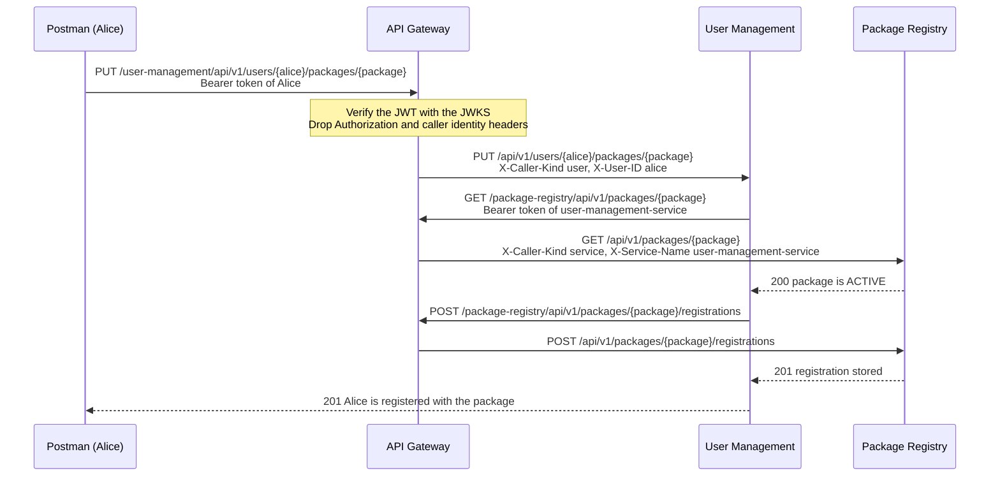
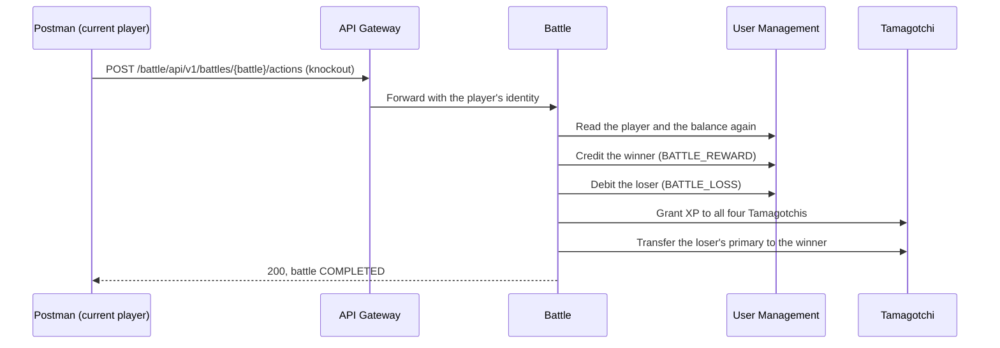
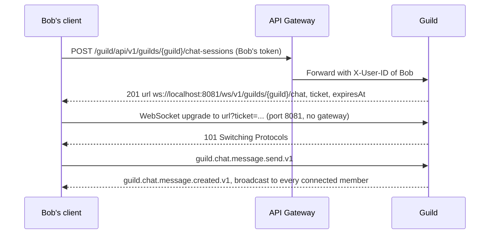
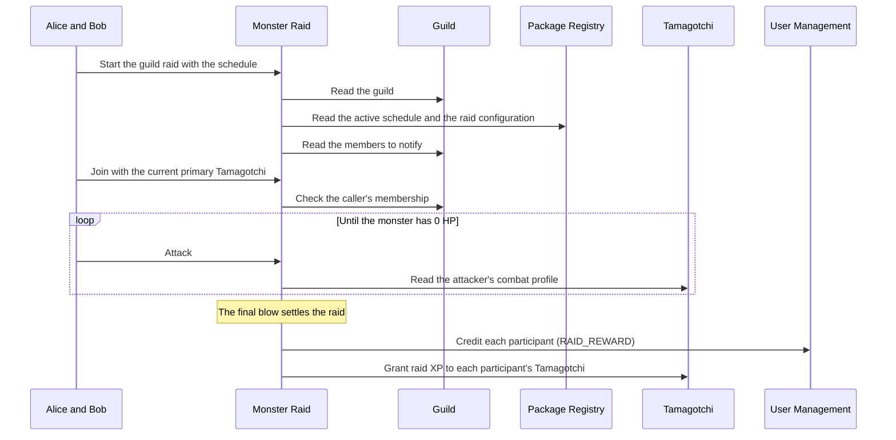

# Game Workflows

[`collections/game-workflows.postman_collection.json`](../collections/game-workflows.postman_collection.json) plays Tamagotchi Go end to end through the API Gateway. It has four game workflows that together reach all eight services, plus a set of resilience drills. This page describes what each flow does, which service calls happen behind every step, and what each check proves. The service-to-service calls listed below are taken from the gateway logs of live runs against the Compose deployment. Setup and run notes are in the collection's own description.

## Overview

| Service | 0. Gateway | 1. Onboarding | 2. Battle | 3. Guild and raid | 4. Drills |
|---|:---:|:---:|:---:|:---:|:---:|
| API Gateway | ✓ | ✓ | ✓ | ✓ | ✓ |
| User Management | ✓ | ✓ | ✓ | ✓ | |
| Package Registry | | ✓ | ✓ | ✓ | |
| Tamagotchi | ✓ | ✓ | ✓ | ✓ | ✓ |
| Battle | ✓ | | ✓ | | |
| Map | | | ✓ | | |
| Guild | | | | ✓ | |
| Monster Raid | | | | ✓ | |
| Notification | | ✓ | ✓ | ✓ | |

Every run builds a new small world, so it never collides with an earlier run:

| Actor | Role in the story |
|---|---|
| Alice | Publishes the game package, challenges Bob, founds the guild |
| Bob | Accepts the challenge, joins Alice's guild, fights the raid with her |
| Carol | A stranger on the map and the source of both players' starter pets |
| Dave | A registered player outside Alice's package, used to show a guild rule |
| Raid admin | A Package Registry administrator who designs and schedules the monster |
| Probe | A throwaway player used only by the gateway checks |

Players get a unique suffix per run, for example `alice-mg2x7k1a`. The package is `Pocket Pets <run>` and the guild `Ember Squad <run>`.

## How a call travels

Clients and services never talk to a service directly. Each REST call goes to the gateway with a bearer token. The gateway verifies the token against the User Management JWKS and removes `Authorization` and any identity headers the caller sent. It then forwards the call with the verified identity: `X-Caller-Kind` plus `X-User-ID` for a user, or `X-Service-Name` for a service. A service that needs another service calls back through the gateway with its own OAuth2 client-credentials token. The `X-Correlation-ID` stays the same along the whole chain.

`Alice joins the package` from workflow 1 shows the pattern. Every arrow from User Management goes through the gateway, and so does every response:

## 0. Gateway entry and authorization

These checks run before any game data exists. They show that the gateway alone decides who is calling.

| Check | Response | What it shows |
|---|---|---|
| Gateway readiness (`/readyz`) | `200` | The gateway has loaded its routes and fetched the signing keys |
| Public signing keys | `200`, RS256 keys with a `kid`, no private members | Anyone can verify tokens, only User Management can issue them |
| Unknown service prefix | `404 ROUTE_NOT_FOUND` | Answered by the gateway; no service owns the path |
| Protected call without a token | `401 MISSING_TOKEN`, `WWW-Authenticate: Bearer` | The call never reaches Battle |
| Malformed token, or `Basic` instead of `Bearer` | `401 INVALID_TOKEN` | Only valid bearer JWTs pass |
| Probe registers, then logs in with a junk `Authorization` header | `201`, then `200` | Public operations drop `Authorization` without checking it |
| Token with the subject swapped and the signature kept | `401 INVALID_TOKEN` | A forged identity fails signature verification |
| Genuine token on the probe's own roster | `200 []` | The same request passes with an untouched token |
| Probe's token plus spoofed `X-User-ID`, `X-Caller-Kind: service`, `X-Service-Name: battle-service` | `403` | The gateway replaced the spoofed headers, so Tamagotchi saw the probe, not Battle |
| Client credentials with a wrong secret | `401 invalid_client` | User Management only issues service tokens to known clients |
| Client credentials for `battle-service` | `200`, `kind: service`, 300 s lifetime, configured scopes | How every service obtains its identity |
| Battle service token used to challenge a player | `403` | A service cannot act as a player |
| User token on the Battle-only combat profile | `403` | Service-only operations refuse users |
| Battle service token on the same operation | `404 TAMAGOTCHI_NOT_FOUND` | Battle is authorized; the random Tamagotchi simply does not exist |

## 1. Onboarding: players, package and pets

Alice, Bob and Carol create accounts and a game world to play in.

| Step | What happens | Calls behind it |
|---|---|---|
| Register three players | Accounts are created without a package (`packageIds: []`) | Public operation, no other service involved |
| Log in | User Management issues each player a 15-minute RS256 user token | — |
| Alice creates her package | `Pocket Pets <run>` is created as a DRAFT with Alice as its developer | — |
| Alice defines the statistics | `hunger`, `happiness` and `energy`, each an integer from 0 to 100, with combat bonus rules: hunger ≥ 80 gives ATTACK −5, happiness ≥ 70 gives ATTACK +5, energy ≤ 20 gives DEFENSE −3 | — |
| Alice defines the battle boosts | `power_snack` (ATTACK +10) and `iron_shell` (DEFENSE +5), each usable once per battle | — |
| Alice activates the package | The package becomes ACTIVE, so players can join it | — |
| Alice, Bob and Carol join it | Package Registry becomes the authority for the membership, and User Management opens a local wallet for the package next to the global one | User Management → Package Registry: read the package, store the registration |
| Combat types | The six types and their cycle: FLAME → NATURE → EARTH → ELECTRIC → WATER → SHADOW → FLAME | — |
| Each player hatches a Tamagotchi | Ember (Alice, FLAME), Ripple (Bob, WATER) and Sprout (Carol, NATURE) start as PRIMARY at level 1 | Tamagotchi → Package Registry: read the statistic definitions |
| Bob sets an undefined `mana` statistic | Rejected with `422 INVALID_LOCAL_STATS` | Tamagotchi → Package Registry: the definitions have no `mana` |
| Alice feeds Ember | Hunger 5 and happiness 95 are stored; energy keeps its value | Tamagotchi → Package Registry: values validated against their ranges |
| Players register phones | Android, iOS and web devices; the Firebase token is never returned | — |
| Alice reads her preferences | All six notification categories are enabled by default | — |

## 2. Social life and a PvP battle

### Friends and the map

Alice sends Bob a friend request, Bob accepts, and User Management reports them as FRIEND. The three players then share their positions: Alice in the city centre, Bob about 45 m north, and Carol about 2 m from Alice. Every location update and every map read makes Map ask User Management for the player's relationships.

- **Alice's map** shows Bob as FRIEND even though he is far away, and Carol as NONE because she is within the 6 m proximity radius.
- **Bob's map** shows Alice but not Carol, a stranger 45 m away.
- **Carol stepping within 6 m of Alice** makes Map publish `map.proximity.detected.v1`. The collection delivers that event to Notification, which pushes it to Alice's and Carol's devices.

### Starter pets and purses

A battle needs each player to bring one PRIMARY and one SECONDARY Tamagotchi. A player only gets a secondary by capturing it in a battle, so the collection stands in for earlier battles. Using the `battle-service` token, it transfers Carol's Sprout to Alice. Carol then hatches Pebble (EARTH), which goes to Bob. Each transfer keeps the same Tamagotchi and only changes its owner and role. Both players are also credited 100 coins, so the loser can pay the battle loss.

### The challenge

Alice challenges Bob with Ember as her primary, Sprout as her secondary, and `power_snack`. Before storing the PENDING challenge, Battle makes eleven calls through the gateway:

| Purpose | Calls |
|---|---|
| Both players exist and their balances | User Management: read each user and their balances |
| Alice's two Tamagotchis | Tamagotchi: read the combat profile and the record with owner and role, for each |
| Package-specific bonuses | Package Registry: read the statistic definitions, once per Tamagotchi |
| The equipped boost | Package Registry: read `power_snack` |

The `battle.request.created.v1` event goes to Bob's phone. Bob finds the challenge among his received, pending requests and accepts with Ripple, Pebble and `iron_shell`. Battle repeats the checks for all four Tamagotchis and both boosts, eighteen calls in all, and starts the battle as ACTIVE.

### The fight

The battle names whose turn it is. Each player opens with their boost, then attacks the opponent's active Tamagotchi. Battle computes the damage from the snapshot taken at the start: levels, type advantage, the package's statistic bonuses and active boosts. When an active Tamagotchi is knocked out, its partner takes over automatically. The battle ends when both of one player's Tamagotchis are down. In one live run the fight took about a dozen turns with hits of 9 to 28 damage: Alice's primary fell, and her secondary finished the fight.

### Settlement

The knockout blow settles the battle within the same call:

All of Battle's calls go through the gateway as `battle-service`, and each command uses the battle ID as its idempotency reference, so a retried settlement never pays twice. The collection then checks:

- The settled battle names a winner and loser and has a result (for example +50 coins for the winner).
- The captured Tamagotchi is in the winner's roster as SECONDARY, and the winner's primary has gained XP.
- The winner's balance is the previous balance plus the reward, and the loser's is the previous balance minus the loss.

The loser no longer has a primary Tamagotchi, so they promote their remaining secondary. Finally `battle.completed.v1` reaches both players' phones.

## 3. Guild life and a Monster Raid

### The raid window

The raid admin is a user listed in Package Registry's administrator allowlist. Package Registry allows only one SCHEDULED or ACTIVE raid window at a time, so the admin first deactivates any window an earlier run left open. The admin then designs the **Gloom Hydra**:

- 120 HP, attack 12, defence 4
- Weak to FLAME, WATER, NATURE and EARTH, and resistant to SHADOW
- At most 30 minutes and 10 participants
- Reward of 75 coins and 120 XP per participant

The admin schedules a window that opens 15 seconds later and lasts an hour, then activates it.

### The guild

Alice founds `Ember Squad <run>` and restricts membership to her package; Guild checks with Package Registry that the package exists.

| Invitation | Calls behind it | Result |
|---|---|---|
| Dave, who never joined the package | Guild → User Management: Dave exists. Guild → Package Registry: no registration (`404`) | `422 MEMBERSHIP_RULE_NOT_SATISFIED` |
| Bob | Same two checks, and Bob's registration exists | PENDING invitation |

The `guild.invitation.created.v1` event goes to Bob's phone. Bob finds the invitation and accepts it, and Guild checks his package registration again before adding him. The guild now has Alice as OWNER and Bob as MEMBER.

### Guild chat over WebSocket

Live chat is the one feature that doesn't run through the gateway. The gateway carries only the negotiation, and the chat traffic goes directly to Guild:

The ticket is 43 base64url characters, is bound to the guild and the user, lasts 60 seconds and works once; reusing it is refused with `401`. The collection checks that the socket URL points to Guild rather than the gateway. Stored messages are also readable over REST through the gateway.

### The raid

Once the window is open, Alice starts the raid for her guild:

Every arrow passes through the gateway; Monster Raid calls as `monster-raid-service`.

- **Start.** The raid snapshots the monster when it starts, so later changes to the configuration cannot affect it. `raid.started.v1` goes to both players' phones.
- **Who can join.** A `monster-raid-service` token trying to join is refused with `403 USER_CALLER_REQUIRED`, because joining needs a player. Alice and Bob join with their current primaries; Battle may have changed these.
- **Damage.** Each attack deals `floor(baseDamage × (1 + (level − 1) / 10) × typeMultiplier)`. The base damage is the monster's attack of 12, and the multiplier is 1.5 against a weakness. In the live runs each level-1 hit did 18 damage, and seven hits brought the Hydra from 120 to 0. If a player is rate limited (`429 ATTACK_RATE_LIMITED`), the other player swings next.
- **Settlement.** The final blow settles the raid within the same call. Each participant is credited 75 coins and their Tamagotchi gets 120 XP, and the raid is COMPLETED.
- **Checks.** The result lists rewards for both players, Alice's balance grew by exactly 75 and her Tamagotchi's XP by exactly 120. `raid.completed.v1` reaches both phones.
- **Cleanup.** The admin deactivates the raid window, so the next run can schedule its own.

## 4. Resilience drills

Each drill needs a failure to be caused by hand. Without one, the drill reports that it was not armed. All drills use the same request, Alice listing her Tamagotchis, so the only difference between them is what fails.

| Failure | Who answers | Response | After |
|---|---|---|---|
| Tamagotchi's database hangs | Tamagotchi itself | `504 REQUEST_TIMEOUT` | about 4 s |
| The Tamagotchi service hangs | Gateway | `504 UPSTREAM_TIMEOUT` | about 5 s |
| The Tamagotchi service is down | Gateway | `502 UPSTREAM_UNAVAILABLE` | immediately |

The timeouts are layered: a service's own deadline (4 s for Tamagotchi and Notification) is shorter than the gateway's 5-second upstream timeout, which is shorter than the gateway's 10-second request deadline. So a slow request is answered by the innermost layer that gives up, and every timeout uses the shared error envelope.

Concurrency limits fail fast instead of queueing:

- **Gateway, per service:** 64 requests in flight. When 100 parallel requests hit a frozen Tamagotchi, 64 waited and timed out with `504`, and 36 were refused at once with `503 CONCURRENCY_LIMIT_REACHED` and `Retry-After: 1`. The gateway logged a `limit_reached` line for each refusal.
- **Gateway, per caller kind:** separate budgets for user, service and anonymous callers, so player traffic cannot starve the service-to-service calls it depends on.
- **Each service:** its own limit (`MAX_CONCURRENCY`). With Tamagotchi limited to 8 and its database frozen, 20 parallel requests gave 8 × `504 REQUEST_TIMEOUT` and 12 × `503 CONCURRENCY_LIMIT_REACHED`, all answered by Tamagotchi itself.

## Events delivered to Notification

No message broker is deployed. Map and Monster Raid log the events they would publish, Guild keeps them in its outbox, and Battle's publishing is mocked. The collection delivers the same event envelopes to Notification's producer endpoint, each with the producing service's own token. Notification then runs its normal path: deduplication, preferences, device lookup and the mocked Firebase push.

| Event | Delivered as | Workflow | Recipients | Category |
|---|---|---|---|---|
| `map.proximity.detected.v1` | `map-service` | 2 | Alice, Carol | PROXIMITY |
| `battle.request.created.v1` | `battle-service` | 2 | Bob | BATTLE_REQUEST |
| `battle.completed.v1` | `battle-service` | 2 | Winner and loser | BATTLE_RESULT |
| `guild.invitation.created.v1` | `guild-service` | 3 | Bob | GUILD_INVITATION |
| `raid.started.v1` | `monster-raid-service` | 3 | Alice, Bob | RAID_LIFECYCLE |
| `raid.completed.v1` | `monster-raid-service` | 3 | Alice, Bob | RAID_LIFECYCLE |
